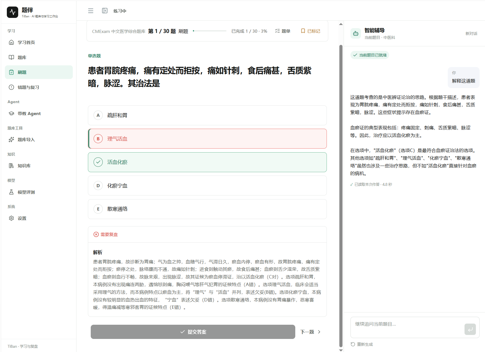
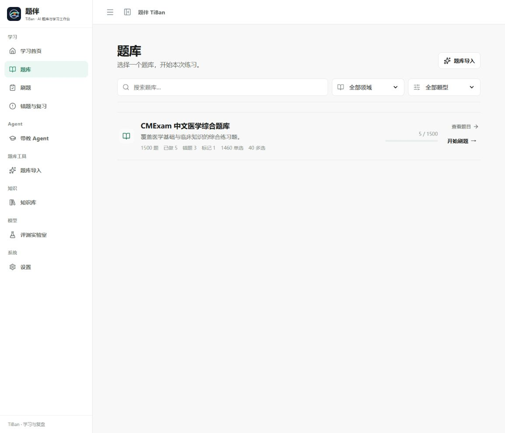
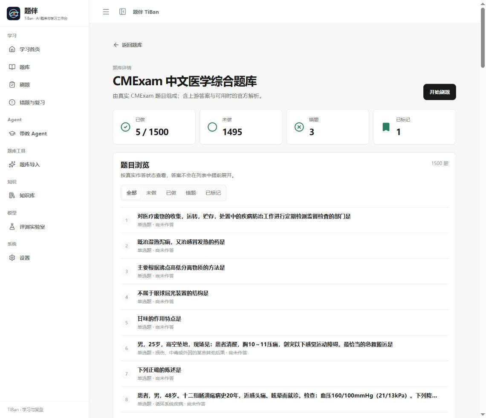
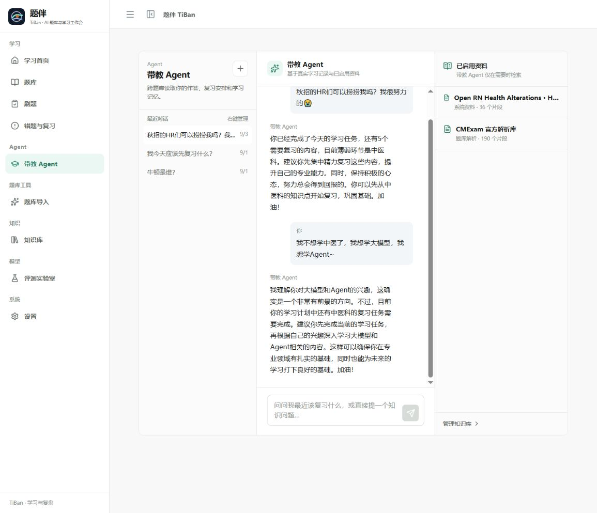
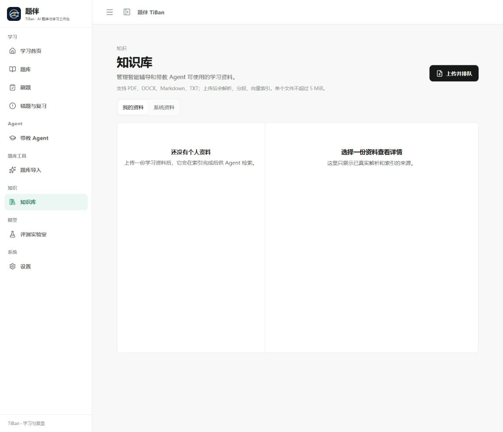
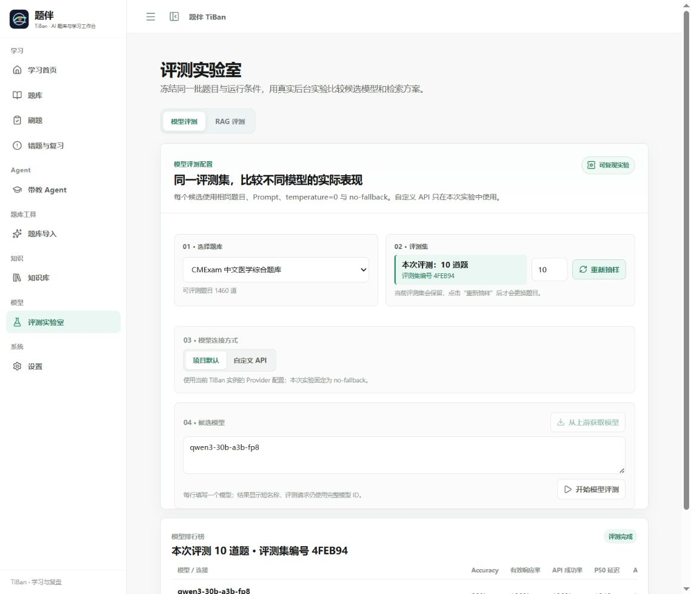
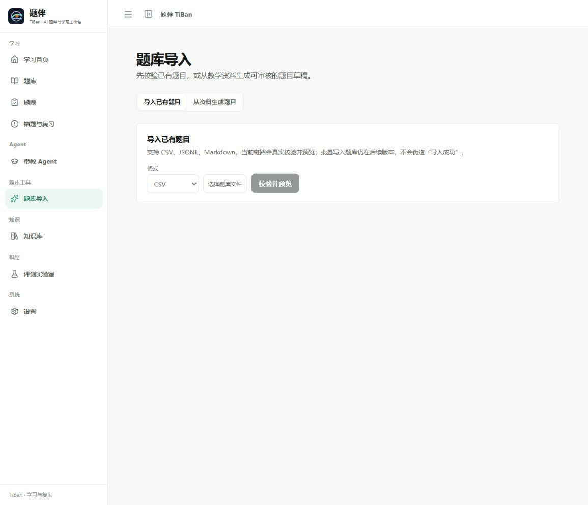
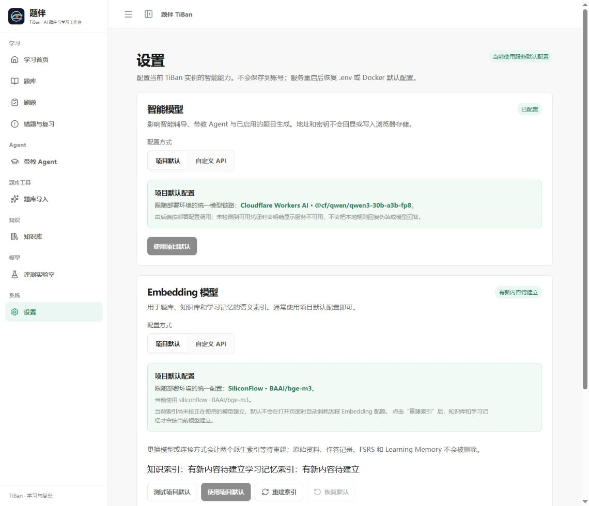
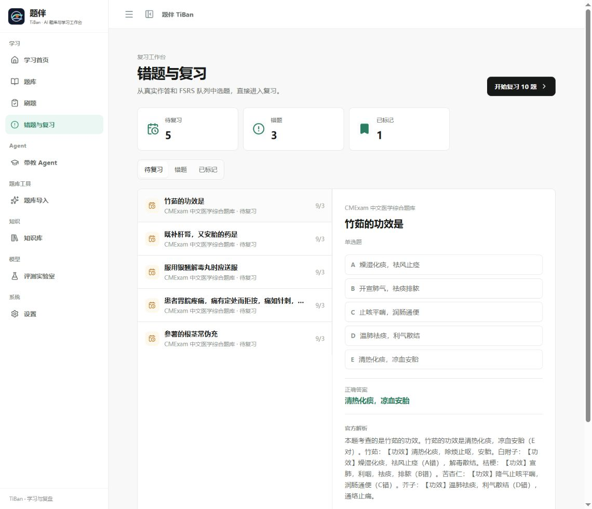

# TiBan

### An Agent-native adaptive learning workspace for every domain

Question banks, contextual tutoring, knowledge retrieval, and review scheduling
work together as one learning path that remembers where the learner is.

[中文 README](./README.md)

  

## What is TiBan?

TiBan connects question banks, learning materials, contextual tutoring, and
long-term learning state in one adaptive workspace. Learners choose a domain,
enter Practice or Exam, answer questions, inspect explanations, ask follow-up
questions, and return later with their progress intact.

The repository includes a Medical Demo Domain Pack for a complete professional
learning journey. The shared learning engine, knowledge layer, and Agent
capabilities are designed to extend to other subjects through additional
domain packs.

## One connected learning path

~~~text
Choose a question bank
        ↓
Practice / Exam
        ↓
Answer, review, and ask the learning assistant
        ↓
Mastery · FSRS review · Learning Memory
        ↓
A more focused next session
~~~

Every submission updates the server-side learning workflow: attempts, mastery,
FSRS scheduling, and learning memory move together. Review queues and bank
progress reflect the learner's actual history.

## Core experience

| Area | Learner experience | Technology |
| --- | --- | --- |
| Question banks | Browse domains, inspect bank scale, and filter by question state | Domain Packs, persistent progress, state projections |
| Practice + assistant | Answer, see feedback, and ask about the current question | Context-aware Tutor, SSE streaming, controlled tool routing |
| Mentor Agent | Review activity across banks and plan the next learning step | Persistent sessions, Learning Memory, Review Queue |
| Knowledge library | Upload and manage PDF, DOCX, Markdown, and TXT sources | Parsing, chunking, versioned indexing, Qdrant retrieval |
| Question import | Validate banks or create reviewable drafts from teaching material | CSV / JSONL / Markdown, quality gates, review and publish |
| Evaluation Lab | Compare runtime models and retrieval profiles under fixed conditions | EvalSuite, durable jobs, versioned RetrievalProfile |

## Product interface

These views are from the current TiBan product and cover the main journey from
selecting a bank to tutoring, review, Agent collaboration, and evaluation.

### Practice + learning assistant

Questions, answer choices, feedback, explanations, and contextual tutoring
share one focused workspace. The assistant understands the current learning
context and can bring in cited material when it is useful.

### Question banks and status browsing

<table>
  <tr>
    <td width="50%"><strong>Question banks</strong> </td>
    <td width="50%"><strong>Bank details and status</strong> </td>
  </tr>
</table>

### Mentor Agent

The Mentor Agent brings together recent attempts, mistakes, review queues, bank
progress, learning memory, and enabled sources across question banks.

  

### Knowledge library

Learning materials become managed, versioned context for the Tutor and Mentor
Agent. Each source has its own parsing, indexing, and enablement state.

  

### Evaluation Lab

The Evaluation Lab freezes the question set, prompt, and runtime conditions so
model and RAG comparisons remain easy to understand and reproduce.

  

### Question import and settings

<table>
  <tr>
    <td width="50%"><strong>Question import</strong> </td>
    <td width="50%"><strong>Settings</strong> </td>
  </tr>
</table>

### Mistakes and review

FSRS scheduling and actual attempts form a durable Review Queue. Learners can
move between due items, mistakes, and marked questions while keeping the full
question detail and explanation in view.

  

## Technical highlights

- **Context-aware Tutor** — every request carries the current question, mode,
  learning phase, and conversation context.
- **Governed retrieval** — the product routes ordinary knowledge directly and
  calls <code>search_knowledge</code> when supporting material is useful; result
  relevance and deduplication keep citations focused.
- **Persistent Learning Memory** — real attempts, review facts, and learning
  conversations become reusable context for the next session.
- **FSRS scheduling** — review timing evolves with the learner's actual
  performance.
- **Domain Pack architecture** — content, terminology, and safety policy live
  with the domain while the learning engine remains reusable.
- **Durable Question Factory** — parsing, generation, quality checks, revisions,
  review, and publishing are traceable and recoverable.
- **Reproducible Evaluation Lab** — EvalSuite freezes questions, prompts, and
  runtime conditions; model runs use <code>temperature=0</code> and no fallback,
  while RAG runs reuse the product <code>RagService</code>.
- **Typed end-to-end contracts** — React communicates with FastAPI through a
  generated OpenAPI client, with SSE for streaming Tutor and job state.

## Technology

~~~text
React 19 + TypeScript + Vite
        │  Generated OpenAPI client + SSE
        ▼
FastAPI + Pydantic + SQLAlchemy
        ├─ PostgreSQL: banks, attempts, reviews, sources, and jobs
        ├─ Qdrant + BGE-M3: knowledge retrieval and semantic learning memory
        ├─ Redis + Dramatiq: import, indexing, and reflection jobs
        ├─ py-fsrs: review scheduling
        └─ OpenAI-compatible providers: model access and evaluation
~~~

## Quick start

Requirements: Python 3.12+, Node.js 22+, npm, and Docker Desktop.

~~~powershell
git clone https://github.com/Luious-LYH/TiBan.git
cd TiBan
docker compose up --build
~~~

Open http://127.0.0.1:5173/ and follow:

~~~text
/banks → bank details → Practice + assistant → submit → Review
~~~

Local regression commands:

~~~powershell
# Backend
cd backend
$env:PYTHONPATH='.'
python -m pytest -q

# Frontend
cd ../frontend
npm run api:check
npm run lint
npm test -- --run
npm run build
~~~

## Data and safety

- Large third-party datasets remain outside the public repository and are
  imported only in authorized local environments.
- API keys stay in local environment configuration or request-scoped runtime
  settings; they are not written to browser storage, databases, logs, or Git.
- Knowledge sources keep their own metadata, versions, parsed chunks, and
  retrieval status.
- Medical Demo output retains physician-review boundaries and safety notices
  for teaching and pre-review assistance.

See [THIRD_PARTY_DATA.md](./THIRD_PARTY_DATA.md) for data attribution and
licensing boundaries.

## Support TiBan

TiBan is independently maintained. If it helps your learning, research, or
project work, you can support continued development through
[Afdian](https://afdian.com/a/tiban).
