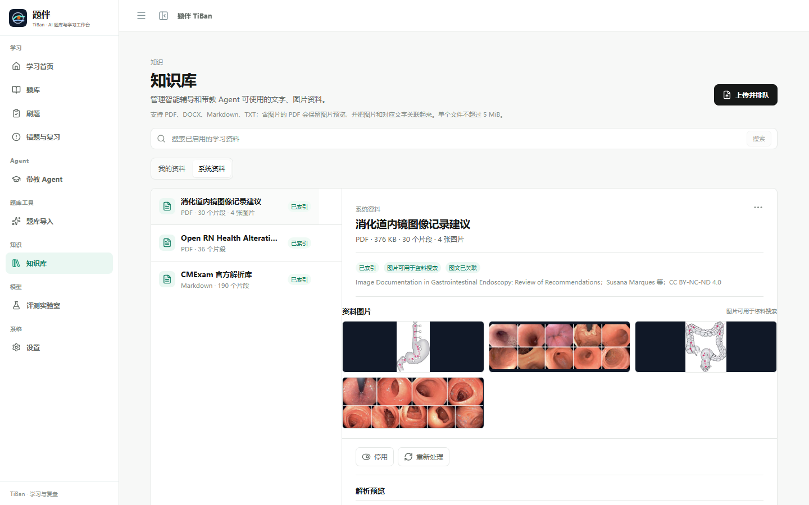
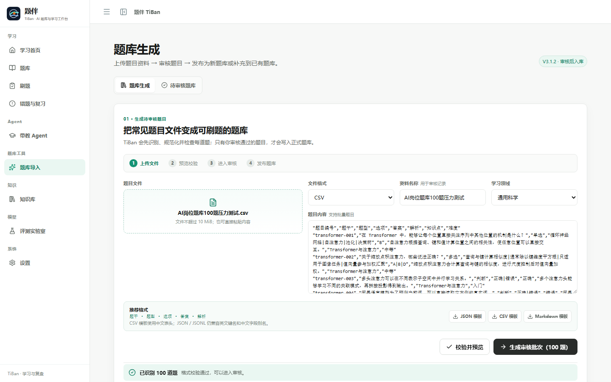
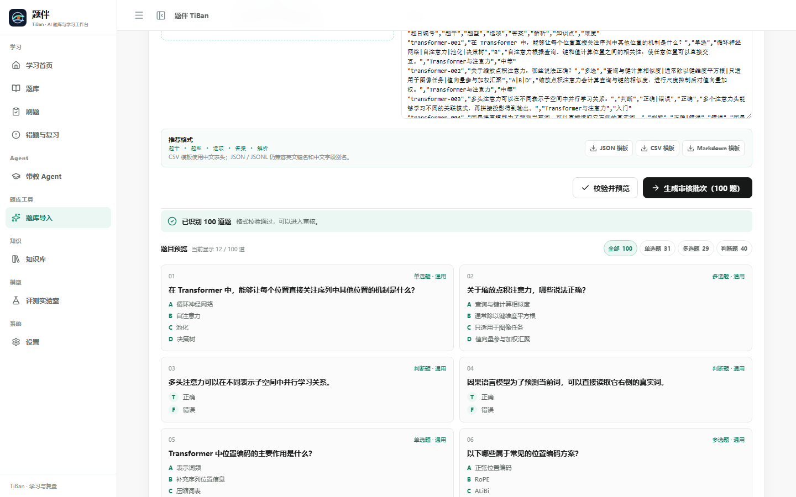
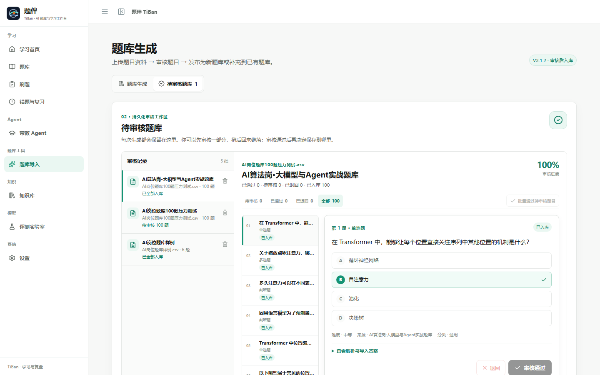
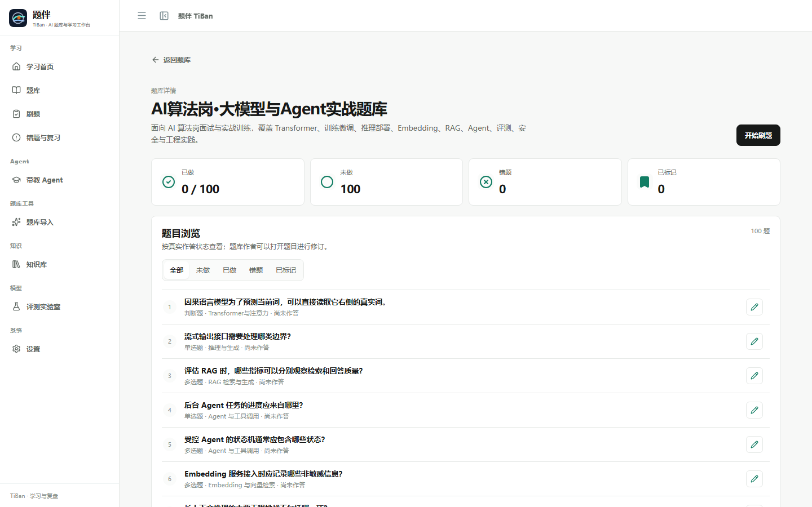
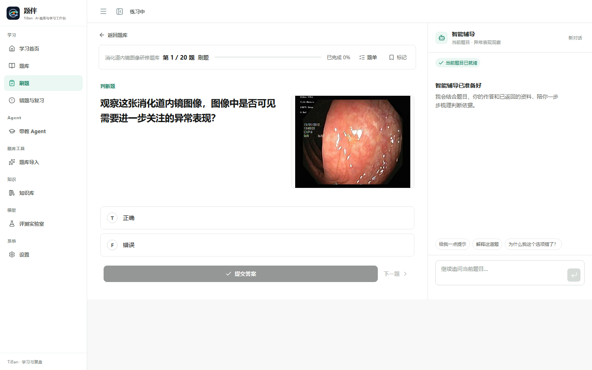

<div align="center">

# 题伴 TiBan

### 面向多领域学习的 Agent-native 智能学习工作台

让题库、智能辅导、知识检索与复习调度围绕学习者持续协同，
把每一次作答都沉淀为下一步更合适的学习行动。

中文 | [English](./README.en.md) | [Demo体验](https://tiban.liuaihub.com/) | [桌面版](https://github.com/Luious-LYH/TiBan/releases/download/v3.5.2/TiBan-3.5.2-x64-Portable.exe) | [赞助](#支持-tiban)🚀

当前发布版本：**v3.5.2** · [版本记录](./docs/releases/V3.5.2.md)

> 推荐直接体验在线 Demo，也可以下载 V3.5.2 Windows 桌面版。

</div>

<p align="center">
  
</p>

## TiBan 是什么 ？

TiBan 是一个把题库、学习资料、智能辅导和长期学习状态连接起来的自适应学习平台。学习者可以按领域选择题库，进入刷题或考试，在同一个专注的工作区完成作答、查看解析、追问难点，并在之后继续从上次的学习轨迹出发。

它同时面向个人学习与专业训练场景：医学 Demo Domain Pack 展示完整的专业学习体验，平台的题库、学习状态、知识库与 Agent 能力可以沿用到其他学科领域。

## 一条会持续积累的学习路径

~~~text
选择题库
   ↓
刷题 / 考试
   ↓
作答、解析与智能辅导
   ↓
掌握度 · FSRS 复习 · Learning Memory
   ↓
更有针对性的下一次练习
~~~

提交答案后，TiBan 会沿着服务端学习工作流记录 Attempt、更新掌握度、安排 FSRS 复习，并整理学习记忆。错题、待复习题和题库进度始终与真实作答保持一致，学习过程因此能够自然延续。

## 核心体验

| 模块 | 学习者可以做什么 | 核心能力 |
| --- | --- | --- |
| 题库与题目状态 | 按领域选择题库，查看规模与已做、未做、错题、标记状态 | Domain Pack、持久化进度、题目状态投影 |
| Practice + 智能辅导 | 在同一工作区完成作答、即时查看解析，并围绕当前题目提问 | 上下文感知 Tutor、SSE 流式交互、受控工具路由 |
| 带教 Agent | 回顾跨题库作答与复习轨迹，获得学习规划和知识问答 | 持久化会话、Learning Memory、Review Queue、只读学习工具 |
| 知识库 | 上传并管理文字与图像资料，查看资料图片、图注和出处 | 版面感知解析、BGE-M3 + CLIP 多路召回、Qdrant 图文索引、证据图 |
| 题库导入 | 校验已有题库，或从教学资料生成可审核的题目草稿 | CSV / JSONL / Markdown、质量门禁、审核发布流水线 |
| 评测实验室 | 在冻结的评测集上比较模型表现与 RAG 检索方案 | EvalSuite、可恢复后台任务、版本化 RetrievalProfile |

## 产品界面

下面的界面来自 TiBan 当前版本，覆盖从选题、刷题、复盘到 Agent 与评测的主要体验。

### 刷题与智能辅导

题目、选项、作答反馈、解析与智能辅导集中在同一工作区。Tutor 能够理解当前题目和学习上下文，在需要资料支持时给出有出处的回答。

### 题库选择与题目状态浏览

<table>
  <tr>
    <td width="50%"><strong>题库</strong><br></td>
    <td width="50%"><strong>题库详情与状态</strong><br></td>
  </tr>
</table>

### 带教 Agent：从一次作答看到长期成长

带教 Agent 跨题库读取近期作答、错题、复习队列、题库进度、学习记忆与已启用资料，帮助学习者梳理当前状态并规划下一步。

<p align="center">
  
</p>

### 知识库：让资料成为可调用的学习上下文

用户资料经过版面感知解析、分段与索引后进入独立的知识管理空间。每份资料都拥有自己的状态与版本，学习者可以控制启停、查看解析结果，并为 Tutor 与带教 Agent 提供稳定的知识来源。

首次启动会自动提供一份“消化道内镜图像记录建议”系统资料示例，来源为项目附带的内窥镜图像记录指南。系统将资料中的 Figure 图注与图片、页码和对应文字段落关联：检索结果可以同时给出相关资料图片与资料出处，Tutor 和带教 Agent 也会在使用这些资料时携带同一份图文证据。

<p align="center">
  
</p>

<p align="center"><em>图文证据链：资料列表展示图片数量与索引状态，详情区同时呈现资料图片、Figure 图注、来源许可和解析片段。</em></p>

<p align="center">
  
</p>

<p align="center"><em>V3.5.2 实际知识库详情：406 页教材解析为 2298 个切块片段，保留 252 张可检索图片；图片预览、正文解析、页码出处与图文关联在同一资料详情中可回溯。</em></p>

### 评测实验室：用可复现的条件比较模型与检索

评测实验室冻结同一批题目、Prompt 与运行条件，支持模型评测和 RAG 评测。结果保留题库、评测集与运行配置的上下文，便于对模型调用质量和检索策略进行清晰比较。

<p align="center">
  
</p>

### 题库导入：从文件到可刷题题目

题库导入是一条完整的内容生产链路，而不是把原始文本直接展示给学习者。用户可以上传或粘贴 JSON、JSONL、CSV、Markdown 题目文件（单文件不超过 10 MiB）；TiBan 会解析并规范化题型、选项、答案和解析，先进行格式校验，再以接近真实刷题的卡片形式分页预览，并支持按单选、多选、判断等题型筛选。

题目图片是可选字段。CSV、JSON、JSONL 可以在图片字段中填写随题目文件一起选择的图片相对路径；系统会先校验图片类型、文件头、大小、像素尺寸和路径，再把图片放入本机受控资产目录。图片不会以 Base64 写入题库、日志或任务消息，纯文本题也不会出现空白图片区域。

校验通过后，题目会进入持久化的“待审核题库”，不会直接写入正式题库。作者可以逐题审核或批量通过，暂时离开后再回来继续；审核通过的题目最终可以新建题库，也可以补充到已有题库，未审核或退回的题目不会进入学习流程。

<p align="center">
  
</p>

<p align="center"><em>文件校验：AI 算法岗 100 道题通过 UTF-8 CSV 导入，系统识别题型并给出真实数量与格式状态。</em></p>

<p align="center">
  
</p>

<p align="center"><em>可读预览：题目以接近刷题的卡片呈现，支持按单选、多选、判断筛选，并按页查看大批量内容。</em></p>

<p align="center">
  
</p>

<p align="center"><em>持久化审核：批次、审核状态、题目列表和逐题审核集中在同一工作台，审核进度可离开后继续。</em></p>

<p align="center">
  
</p>

<p align="center"><em>正式入库：审核通过后题目写入正式题库，可直接开始刷题，也可在题库详情中编辑题目或删除题库。</em></p>

### 图像题与图片对话

题库中有图片时，刷题、题库详情和审核工作区会使用同一套图像题卡：图片按比例完整展示，不裁剪内镜图像；没有图片的题目仍按原来的纯文本布局显示。当前版本附带的本地演示题库为“消化道内镜图像研修题库”，包含 30 道图像题，用于演示导入、审核、发布和刷题闭环。题库图片资产与知识库图片索引隔离，不会污染知识检索。

在 Practice 的智能辅导或带教 Agent 中，可以把一张图片直接拖入输入区域，或从剪贴板粘贴（Ctrl+V / 右键粘贴）；发送前会显示缩略图，也可以移除后重新附加。每次对话最多附加一张图片。文本问题沿用项目默认模型链路，带图片的问题会自动进入视觉模型链路；图片会作为真实视觉内容参与模型请求，而不是只把图片地址写进提示词。

<p align="center">
  
</p>

<p align="center"><em>图像题实践：题目图片按比例展示，题干、选项与 Tutor 保持原有刷题工作区布局。</em></p>

图片只作为教学研修和医生复核前辅助材料使用，请勿上传包含患者身份信息的文件。

### 模型与 Embedding 设置

<p align="center">
  
</p>

### 错题与复习

FSRS 复习调度和真实作答记录共同构成 Review Queue，学习者可以在待复习、错题与已标记之间切换，并直接查看题目详情与官方解析。

<p align="center">
  
</p>

## 技术亮点

### 多模态 RAG 与视觉 Agent

**关键词速览：** `Multimodal RAG` · `Vision Agent` · `Layout-aware Ingestion` · `Figure-caption Grounding` · `CLIP` · `BGE-M3` · `Qdrant` · `Evidence Graph / GraphRAG` · `Provenance` · `OpenAI-compatible Vision API`

```text
图文资料 / 图片题
      ↓ 版面感知解析与受控资产管理
Figure caption + 页码 + 章节 + 文字片段
      ├─ BGE-M3 文字混合召回
      ├─ CLIP 文字 ↔ 图片共享向量召回
      └─ Evidence Graph 一跳跨模态证据扩展
      ↓ 图文证据包（图片 / 图注 / 来源 / 页码）
Tutor / Mentor Vision Agent
```

- **Layout-aware PDF ingestion**：使用 PyMuPDF 读取文本块、图片位置和 Figure caption，将有效图片与最近图注、页码、章节及文字片段绑定；无图注的装饰图、Logo 和页眉不进入图片索引。
- **三路跨模态召回**：BGE-M3 负责文字混合检索，CLIP 建立文字与图片共享向量空间并写入 Qdrant，受控概念图提供一跳的文字 ↔ Figure 证据扩展。
- **Evidence-grounded GraphRAG**：图谱关系来自图注、章节文本和受控内镜概念表；每个结果保留图片、图注、页码、来源和关联文字，支持从文字证据追到图片，也支持从图片回到对应段落。
- **Vision-capability routing**：Tutor/Mentor 沿用同一 Provider 调用链；有图片时组装 OpenAI-compatible 的文本内容块与 `image_url` 内容块，视觉模型负责读取图片，文本请求不改变原有默认链路。
- **受控多模态资产层**：图片通过 MIME、文件头、大小、像素尺寸和路径安全校验，运行时保存图片字节，数据库、Qdrant payload、日志和任务消息只保留不透明资产 ID 与必要 provenance。

这条链路把“图片能被展示”推进到“图片可检索、可关联、可追溯、可进入视觉 Agent 上下文”：知识库返回的图文证据和 Tutor/Mentor 使用的视觉输入来自同一份受控资产与来源记录。

### Agent-native 学习工作流

- **Context-aware Tutor**：请求携带当前题目、练习模式、作答阶段和会话上下文，Study、Exam、Review 使用清晰的行为边界。
- **受控知识检索**：普通知识直接回答，真正需要资料时才触发 <code>search_knowledge</code>；召回结果经过领域、命名空间、相关性和去重处理。
- **可追溯引用**：回答中的资料出处与知识源、章节和片段关联，学习者可以沿着回答回到原始上下文。
- **Persistent Learning Memory**：从真实 Attempt、复习事实和学习对话中整理长期记忆，为下一次学习提供连续上下文。
- **FSRS 调度**：每次提交都会进入复习安排，学习节奏由真实掌握变化持续调整。

### 可靠的内容与评测基础设施

- **Domain Pack 架构**：领域内容、术语与安全策略由 Domain Pack 承载，学习引擎和 Agent 能力保持跨领域复用。
- **Durable Question Factory**：资料解析、题目生成、质量检查、修订、审核和发布拥有明确状态，后台任务支持追踪与恢复。
- **Reproducible Evaluation Lab**：EvalSuite 固定题目、Prompt 与运行条件；模型评测使用 <code>temperature=0</code> 与 no-fallback，RAG 评测复用产品运行中的同一套 <code>RagService</code>。
- **端到端类型契约**：React 前端通过生成的 OpenAPI Client 与 FastAPI 服务端通信，SSE 为 Tutor 与后台任务提供流式状态更新。

## 技术栈

~~~text
React 19 + TypeScript + Vite
        │  Generated OpenAPI Client + SSE
        ▼
FastAPI + Pydantic + SQLAlchemy
        ├─ PostgreSQL：题库、作答、复习、知识源与任务状态
        ├─ PyMuPDF：版面感知 PDF 解析、Figure / caption 对齐
        ├─ Qdrant + BGE-M3：文字混合检索与学习记忆语义索引
        ├─ Qdrant + CLIP：文字到图片的共享向量检索
        ├─ Evidence Graph：受控概念图与一跳跨模态证据扩展
        ├─ Redis + Dramatiq：题库导入、索引与记忆整理后台任务
        ├─ py-fsrs：复习调度
        └─ OpenAI-compatible Vision Providers：文本 / 图片能力路由与评测
~~~

## 快速开始

环境要求：Python 3.12+、Node.js 22+、npm 和 Docker Desktop。

~~~powershell
git clone https://github.com/Luious-LYH/TiBan.git
cd TiBan
docker compose up --build
~~~

启动后访问 http://127.0.0.1:5173/，推荐按下面的顺序体验：

~~~text
/banks → 题库详情 → 开始刷题 → Practice + 智能辅导 → 提交答案 → 错题与复习
~~~

本地回归命令：

~~~powershell
# Backend
cd backend
$env:PYTHONPATH='.'
python -m pytest -q

# Frontend
cd ../frontend
npm run api:check
npm run lint
npm test -- --run
npm run build
~~~

## 数据与安全

- 大型第三方题库只在获得授权的本地环境中导入，不随公共仓库分发。
- API Key 保存在本地环境配置或请求级运行时配置中，不写入浏览器存储、数据库、日志或 Git。
- 知识资料拥有独立的来源、版本、解析片段和启停状态，便于管理 Agent 可以使用的内容范围。
- 医学 Demo 输出保留医生复核要求和安全提示，用于教学训练与医生复核前辅助。

数据来源与授权边界见 [THIRD_PARTY_DATA.md](./THIRD_PARTY_DATA.md)。

## 项目文档

- [项目总览](./docs/portfolio/PROJECT_OVERVIEW.md)
- [TiBan Demo Flow](./docs/v3/portfolio/V3_DEMO_FLOW.md)
- [智能辅导与带教 Agent 架构](./docs/architecture/tutor-agent.md)
- [题库导入架构](./docs/architecture/question-factory.md)
- [知识检索管线](./docs/architecture/rag-pipeline.md)
- [V3.5.2 多模态 RAG 简历与面试准备](./docs/portfolio/V3.5.2_RESUME_AND_INTERVIEW.md)
- [V3.5.2 版本记录](./docs/releases/V3.5.2.md)
- [多模态图文证据链](./docs/architecture/multimodal-evidence-rag-v35.md)
- [领域包与共享核心](./docs/architecture/domain-packs-v2.md)
- [数据来源与许可边界](./THIRD_PARTY_DATA.md)

## Windows 桌面版

当前 Windows 桌面包为 **v3.5.2**，也可以直接访问[在线 Demo](https://tiban.liuaihub.com/)。

[下载 Windows 便携版（v3.5.2）](https://github.com/Luious-LYH/TiBan/releases/download/v3.5.2/TiBan-3.5.2-x64-Portable.exe)

## 支持 TiBan

TiBan 由个人持续维护。如果这个项目对你的学习、研究或项目实践有所帮助，欢迎通过[爱发电支持 TiBan](https://afdian.com/a/tiban)，帮助项目持续完善。

