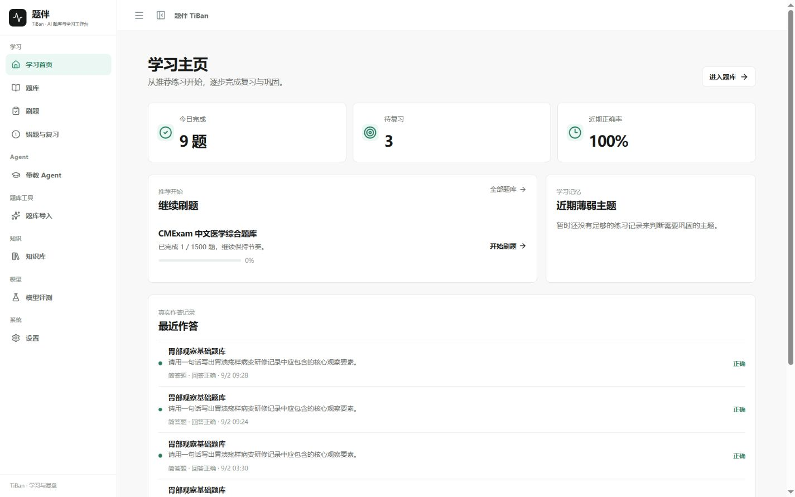
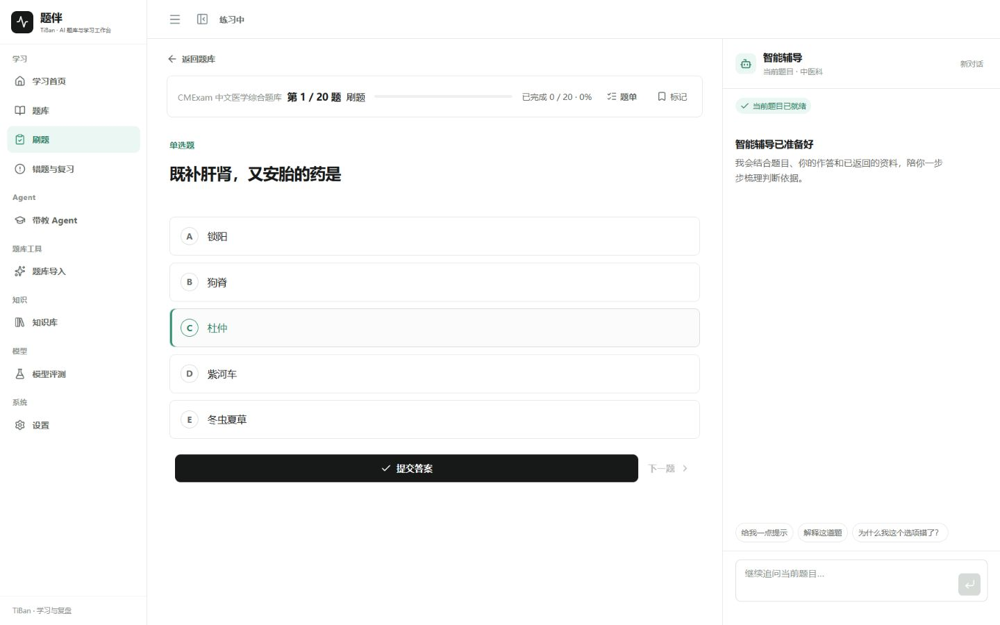
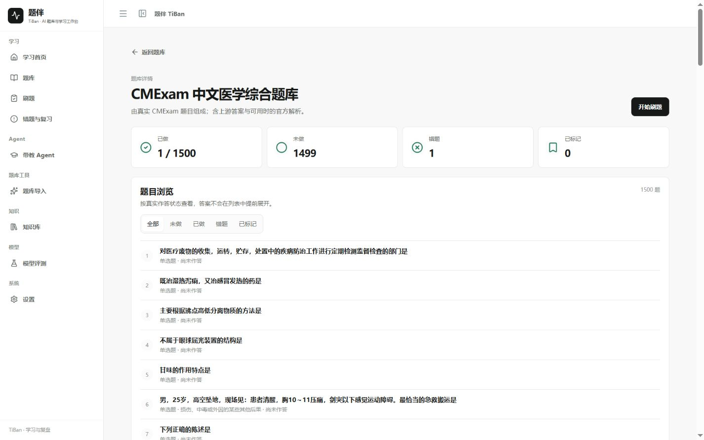
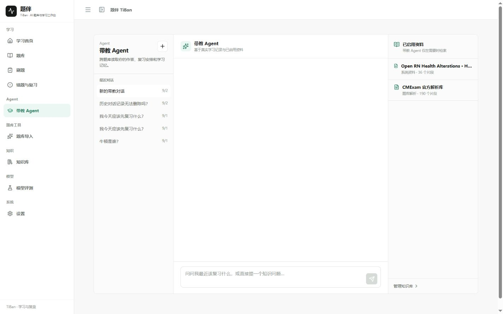
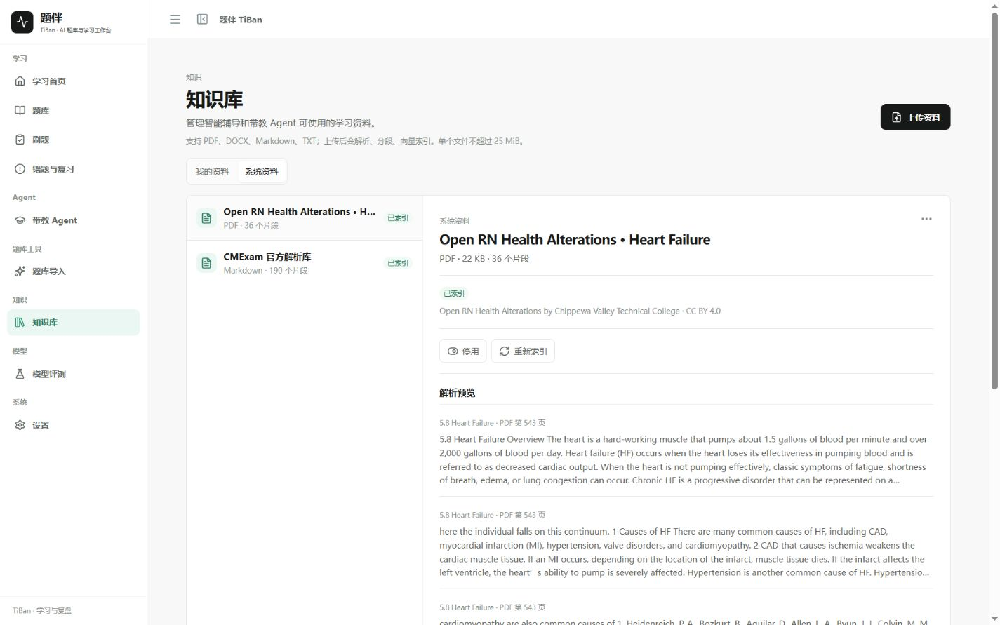
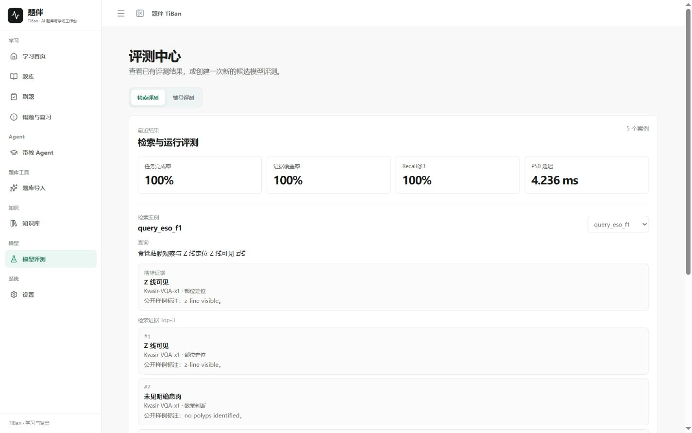

<div align="center">

# 题伴 TiBan

### 面向多领域学习的 Agent-native 智能学习工作台

把题库、刷题、智能辅导、知识检索与复习调度，组织成一条会持续积累的学习路径。

[English](./README.en.md)

</div>



### 让每一道题都成为下一步学习的起点

TiBan 是一个按领域组织题库、资料与学习进度的智能学习工作台。学习者可以从题库选择刷题或考试，在清晰的题目工作区中完成作答，并随时向右侧的智能辅导提问。

仓库默认附带 Medical / Endoscopy Demo Domain Pack，用于展示完整的专业学习闭环；平台核心学习、智能辅导、带教 Agent、RAG、FSRS、学习记忆和题库导入流程按 Domain Pack 设计，可平滑接入其他领域题库与知识源。

提交之后，系统会把本次作答沉淀为可继续使用的学习状态：掌握度、复习安排、薄弱主题和学习记忆会沿着同一条路径持续更新。下一次打开 TiBan 时，学习不会从空白开始。

智能辅导理解当前题目、练习模式和作答上下文；需要资料支持时，它会检索已启用的知识来源，并把关键出处放在回答旁边。它始终围绕当前学习任务工作，像一位安静而持续的辅导伙伴。

### 一条连贯的学习路径

```text
选择题库
   ↓
刷题 / 考试
   ↓
作答与智能辅导
   ↓
即时评分与题目解析
   ↓
掌握度 · FSRS 复习 · 学习记忆
   ↓
下一次更合适的练习
```

### 核心体验

| 模块 | 体验 | 技术能力 |
| --- | --- | --- |
| 题库与题库详情 | 先了解题库规模，再按全部、未做、已做、错题和标记浏览 | 领域隔离、题目状态投影、持久化进度 |
| Practice | 题目、选项、题单和进度集中在一个工作区，作答后即时得到清晰反馈 | FastAPI 学习工作流、Attempt、服务端评分 |
| 智能辅导 | 围绕当前题目提示、追问和讲解；回答需要资料时显示清晰出处 | 受控工具路由、语义检索、Citation、SSE 流式交互 |
| 带教 Agent | 跨题库查看最近作答、复习队列、题库进度和学习记忆，帮助安排下一步 | 持久化对话、只读学习工具、跨会话上下文 |
| 题库导入 | 校验已有 CSV / JSONL / Markdown，或从教学资料生成可审核题目 | 解析、来源绑定、Gate、Judge、Repair、Review / Publish |
| 知识库 | 管理 PDF、DOCX、Markdown、TXT，查看解析片段并控制是否参与检索 | 文档版本、分段索引、BGE-M3 Provider、Qdrant |
| 评测实验室 | 冻结同一批题目与运行条件，对比候选模型和 RAG 检索方案 | EvalSuite、Durable Job、版本化 RetrievalProfile、Typed Output |

### 产品界面

以下界面展示 TiBan 的主要使用路径与核心工作区。

<table>
  <tr>
    <td width="50%"><strong>学习首页</strong><br></td>
    <td width="50%"><strong>Practice + 智能辅导</strong><br></td>
  </tr>
  <tr>
    <td width="50%"><strong>题库详情与状态浏览</strong><br></td>
    <td width="50%"><strong>带教 Agent</strong><br></td>
  </tr>
  <tr>
    <td width="50%"><strong>知识库</strong><br></td>
    <td width="50%"><strong>模型评测</strong><br></td>
  </tr>
</table>

### Agent-native 的技术主线

TiBan 把 Agent 能力放在真实学习流程中：

- **Context-aware 智能辅导**：每次请求都携带当前题目、学习者、练习模式和作答阶段，Study、Exam、Review 遵循不同的权限边界。
- **受控 Retrieval**：只有在问题确实需要资料时才检索；检索结果经过领域、命名空间、相关性和去重处理，再以章节、页码和片段形式回到回答中。
- **Persistent Learning Memory**：学习记忆来自真实作答与复盘事实，帮助系统理解近期薄弱点和下一步训练方向。
- **FSRS 复习调度**：每次提交都会进入持续计算的复习链路，形成下一次练习的时间依据。
- **Durable Question Factory**：资料解析、题目生成、质量门禁、Judge、修订、人工审核和发布都有明确状态，任务可以被追踪和恢复。
- **Reproducible Evaluation Lab**：每次实验把题库版本、抽样题目、Prompt 与运行条件冻结为 EvalSuite；模型评测固定 temperature=0 和 no-fallback，RAG 评测只切换可版本化的 RetrievalProfile，并复用 Tutor/Mentor 的同一 RagService。
- **Domain Pack 架构**：内容、术语与安全策略由领域包承载，学习引擎与 Agent 能力保持跨领域复用；仓库以 Medical / Endoscopy 和 General Science 展示这一扩展能力。

### 技术栈

```text
React 19 + TypeScript + Vite
        │  OpenAPI typed client + SSE
        ▼
FastAPI + Pydantic + SQLAlchemy
        ├─ PostgreSQL：题库、作答、复习、知识源和任务状态
        ├─ Qdrant + BGE-M3 Provider：受治理知识检索与长期记忆语义索引
        ├─ Redis + Dramatiq：可恢复的导入、索引与记忆整理任务
        ├─ py-fsrs：复习调度
        └─ OpenAI-compatible Provider：受安全边界约束的模型调用
```

前端通过生成的 OpenAPI 类型访问后端，服务端工作流统一维护题库、作答、复习与 Agent 状态。医疗教学内容始终保留医生复核边界；TiBan 用于教学训练与医生复核前辅助，不替代临床诊断或治疗决策。

### 快速开始

环境要求：Python 3.12+、Node.js 22+、npm 和 Docker Desktop。

```powershell
git clone https://github.com/Luious-LYH/TiBan.git
cd TiBan
docker compose up --build
```

启动后访问 `http://127.0.0.1:5173/`，推荐按下面的顺序体验：

```text
/banks → 题库详情 → 开始刷题 → Practice → 提交答案 → 错题与复习
```

题库导入、知识库、带教 Agent、评测实验室和设置，构成从资料到学习反馈的完整平台体验。

本地回归：

```powershell
# Backend
cd backend
$env:PYTHONPATH='.'
python -m pytest -q

# Frontend
cd ../frontend
npm run api:check
npm run lint
npm test -- --run
npm run build
```

### 数据与安全

- CMExam、CMB-Exam、Kvasir 等大型第三方数据只在获得授权的本地环境中导入，不随公共仓库分发。
- API Key 仅存放在本地 `.env` 或请求级运行时配置中，不写入浏览器存储、数据库或 Git。
- 知识库资料拥有独立的来源、版本、解析片段和启停状态，便于控制哪些内容可以参与 Agent 检索。
- 医疗相关输出保留医生复核要求和安全提示，不生成面向真实患者的自主诊断或治疗结论。

数据来源与授权边界见 [`THIRD_PARTY_DATA.md`](./THIRD_PARTY_DATA.md)。

### 项目文档

- [项目总览](./docs/portfolio/PROJECT_OVERVIEW.md)
- [TiBan Demo Flow](./docs/v3/portfolio/V3_DEMO_FLOW.md)
- [智能辅导与带教 Agent 架构](./docs/architecture/tutor-agent.md)
- [题库导入架构](./docs/architecture/question-factory.md)
- [知识检索管线](./docs/architecture/rag-pipeline.md)
- [领域包与共享核心](./docs/architecture/domain-packs-v2.md)
- [数据来源与许可边界](./THIRD_PARTY_DATA.md)
