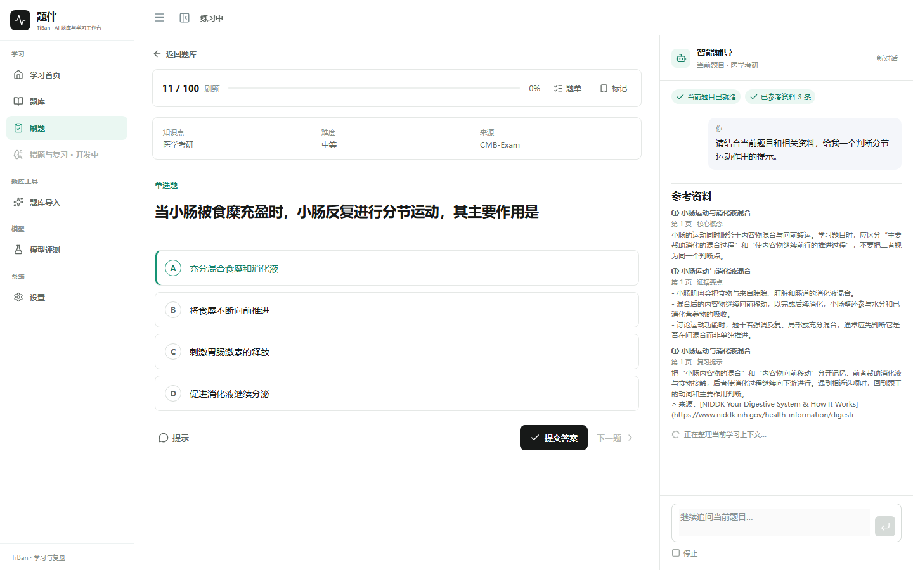
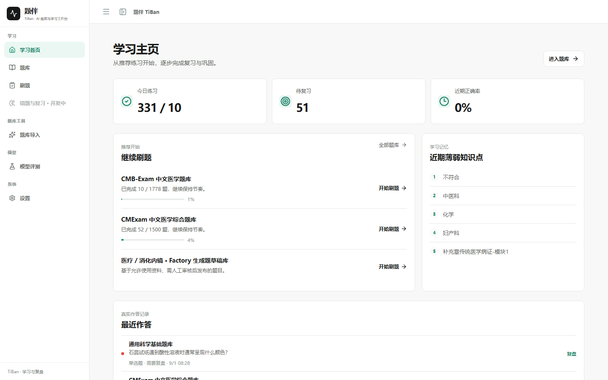
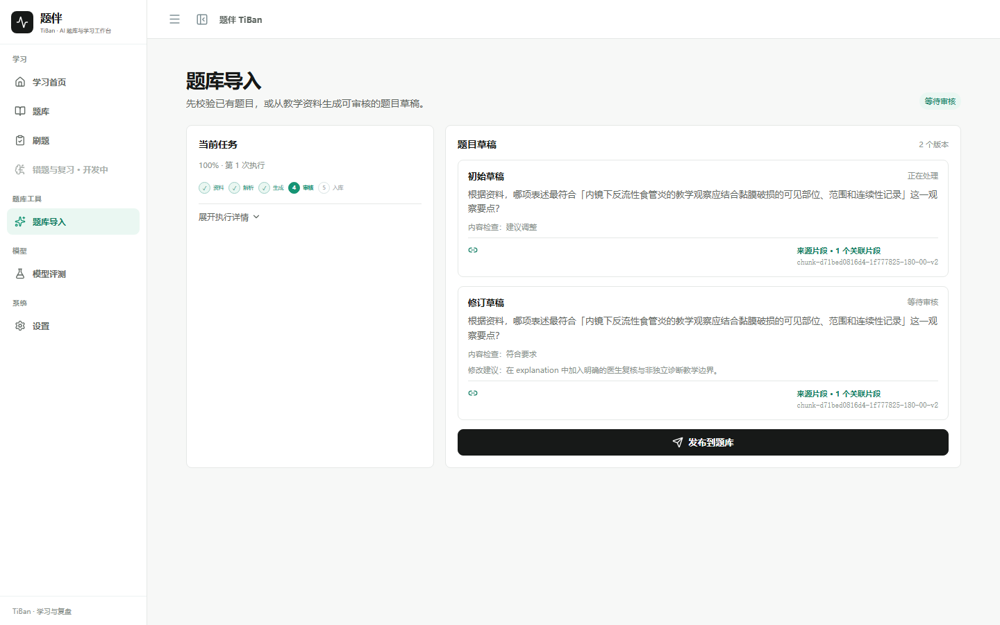
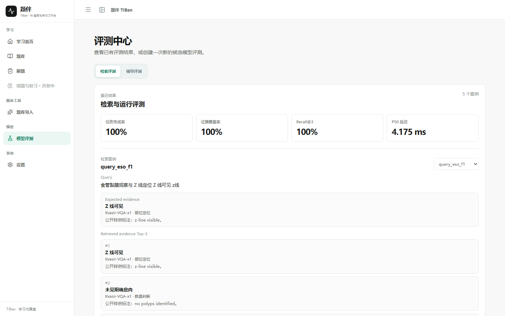

# 题伴 TiBan

**Agent-native Question Bank & Learning Workspace**

TiBan brings question banks, a persistent Tutor Agent, retrieval, learning memory,
FSRS review, question generation and model evaluation into one learning
workflow. The current domain packs are Medical / Endoscopy and General
Science.



## What you can do

- Browse question banks and start focused 刷题 or 考试 sessions.
- Practice with a Tutor that stays beside the current question and uses the
  question, permitted evidence and learner context.
- Submit an answer and continue through grading, Attempt history, mastery and
  review scheduling.
- Open the 题库导入 workspace to validate an existing CSV/JSONL/Markdown bank,
  or create a source-backed question draft from an allowed teaching document,
  review revisions and publish the selected version.
- Compare candidate models on text and image-question evaluation sets through a
  separate evaluation workspace.
- Configure the current TiBan instance's LLM and Embedding runtime without
  storing API keys in the browser; runtime overrides restore their defaults on
  service restart.
- Switch domain packs without changing the Practice, Tutor, Memory, FSRS or
  Evaluation flow.

## Why TiBan

### Tutor Agent + Tool Calling + RAG

The Tutor combines bounded tool use, knowledge retrieval and learner context in
the practice sidecar. Successful submission keeps learning-state writes in the
application workflow: `grade → Attempt → mastery → review scheduling`.

### Adaptive Learning + FSRS + Memory

Attempts, mastery, learning memory and FSRS cards feed the next practice
session. In the fixed adaptive scheduling scenario, weak-topic exposure rose
from **25% to 75%** after evidence of repeated mistakes.

### Question Factory

The Factory turns an allowed document into a reviewable question through
parsing, indexing, generation, deterministic gates, judging, repair and
publishing. PostgreSQL stores job and revision state; Redis/Dramatiq runs
durable background jobs; Qdrant and FastEmbed support retrieval.

### Modular Monolith + Domain-extensible Core

React + FastAPI share a modular learning core across domain packs. Practice,
Tutor, Factory and Learning use explicit boundaries, typed contracts and
provider adapters while keeping the product runnable as one platform.

## Product surfaces

| Practice + Tutor | Adaptive learning |
| --- | --- |
|  |  |

| Question Factory | Model evaluation |
| --- | --- |
|  |  |

## Current Scope

- Medical / Endoscopy is the primary content domain for teaching and
  physician-review-before-use workflows.
- General Science is a lightweight reference domain with 8 project-authored
  questions. It exercises the same shared platform core.
- EndoBench is an Evaluation dataset. It stays outside Tutor retrieval,
  Question Factory and learner-facing QBanks.
- External model providers are configured separately from the reproducible
  local stack.

## Data

The repository ships compact public clean-start fixtures so a new checkout can
run without redistributing large third-party datasets.

The local/hosted portfolio dataset is kept outside Git and contains:

| Dataset | Questions | Use |
| --- | ---: | --- |
| CMExam | 1,500 | Medical QBank |
| CMB-Exam | 1,778 | Medical QBank |
| Curated Kvasir-VQA | 400 | Image-question QBank |
| **Total** | **3,678** | Portfolio dataset |

Source attribution and reuse boundaries are recorded in
[`THIRD_PARTY_DATA.md`](./THIRD_PARTY_DATA.md). User and organization-owned
source uploads follow the same source registry and domain boundary.

## Architecture

```text
React + Vite + TypeScript
          │ generated OpenAPI client / SSE
FastAPI ──┼── PostgreSQL: learning, citation and job state
          ├── Qdrant: retrieval index
          ├── Redis + Dramatiq: durable Factory jobs
          ├── bounded Tutor runtime: tools, permissions, retry, cancel, trace
          ├── Question Factory: Generator → gate → Judge → repair → publish
          ├── py-fsrs: review scheduling
          └── isolated model-evaluation workspace
```

The API contract is generated from FastAPI OpenAPI:

```powershell
cd frontend
npm run api:generate
```

Architecture details live in [`docs/architecture/`](./docs/architecture/),
starting with the [platform core](./docs/architecture/platform-core-v2.md) and
the [project overview](./docs/portfolio/PROJECT_OVERVIEW.md).

## Evaluation

### Tutor routing evaluation

Six fixed Tutor routing and permission scenarios:

- Tool selection: **6 / 6**
- Unnecessary tool calls: **0**
- Missing tool calls: **0**

See the [Agent evaluation](./docs/evals/agent-evaluation-v2.md) for the test
setup and artifact links.

### Retrieval and learning evaluation

The RAG benchmark compares sparse, dense, hybrid and hybrid + rerank on the
same frozen dataset using Recall@K, MRR, nDCG and retrieval latency. The
[adaptive-loop artifact](./artifacts/learning/adaptive-loop-demo-v1.json)
shows the transition from a deliberate mistake to a weak-topic next-session
recommendation.

## Quick start

Requires Python 3.12+, Node.js 22+, npm and Docker Desktop.

```powershell
docker compose up --build
```

This starts the frontend, FastAPI backend, PostgreSQL, Qdrant, Redis and the
Dramatiq worker with the public clean-start fixtures.

Useful local checks:

```powershell
# Backend
cd backend
$env:PYTHONPATH='.'
python -m pytest -q

# Frontend
cd ../frontend
npm run api:check
npm run lint
npm test -- --run
npm run build
```

Open the app at `http://127.0.0.1:5173/`, then follow `/banks` → `/practice`.
The [V3 core demo flow](./docs/v3/portfolio/V3_DEMO_FLOW.md) covers the main
刷题 → 智能辅导 → Citation → Submit → Review path, with Factory and Evaluation
as the secondary demonstrations.

## Project docs

- [Project overview](./docs/portfolio/PROJECT_OVERVIEW.md)
- [Demo script](./docs/portfolio/DEMO_SCRIPT.md)
- [Tutor architecture](./docs/architecture/tutor-agent.md)
- [Question Factory architecture](./docs/architecture/question-factory.md)
- [Domain packs](./docs/architecture/domain-packs-v2.md)
- [V3 Phase E final report](./docs/v3/V3_PHASE_E_FINAL_REPORT.md)
- [V3 evidence matrix](./docs/portfolio/FINAL_EVIDENCE_MATRIX.md)
- [TiBan v2.0 release report](./docs/V2_RELEASE_REPORT.md)
- [Data attribution](./THIRD_PARTY_DATA.md)

## License

Code follows the repository license. Third-party datasets remain outside the
repository; their attribution and reuse boundaries are listed in
[`THIRD_PARTY_DATA.md`](./THIRD_PARTY_DATA.md) and
[`knowledge/registry/sources.yaml`](./knowledge/registry/sources.yaml).
