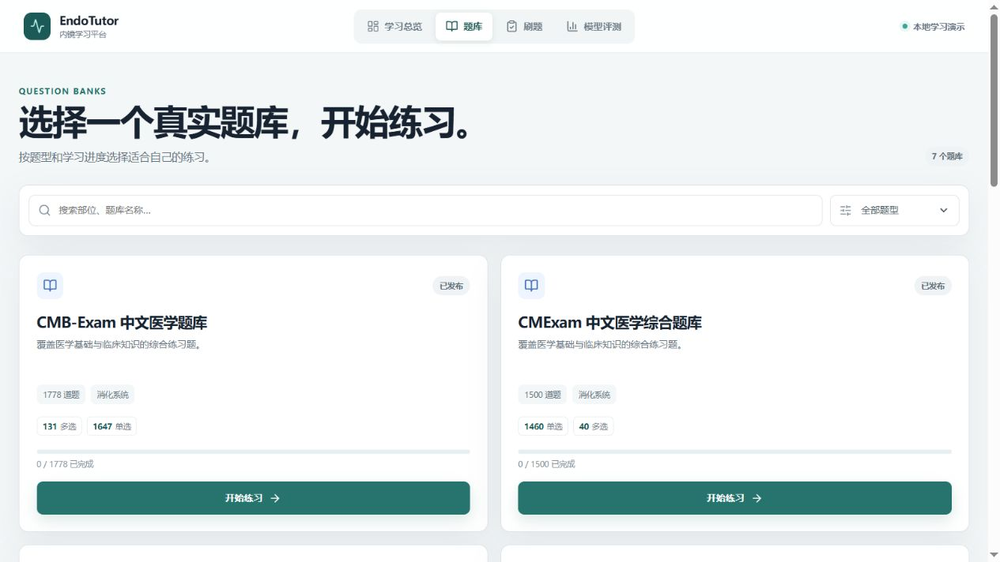
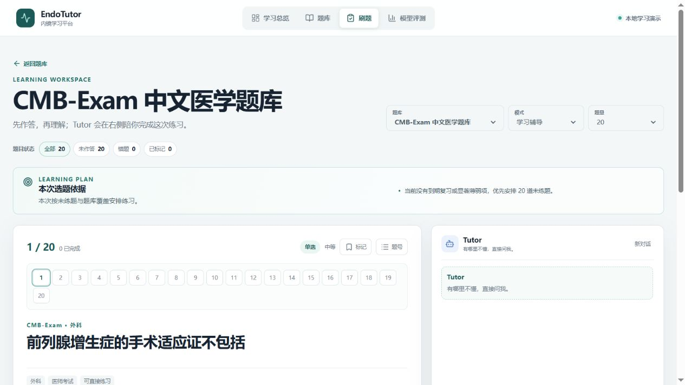
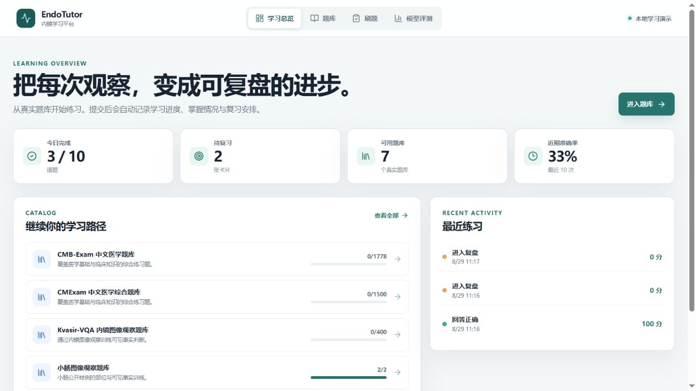
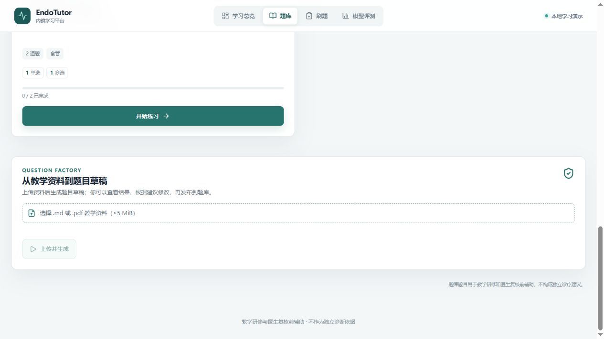
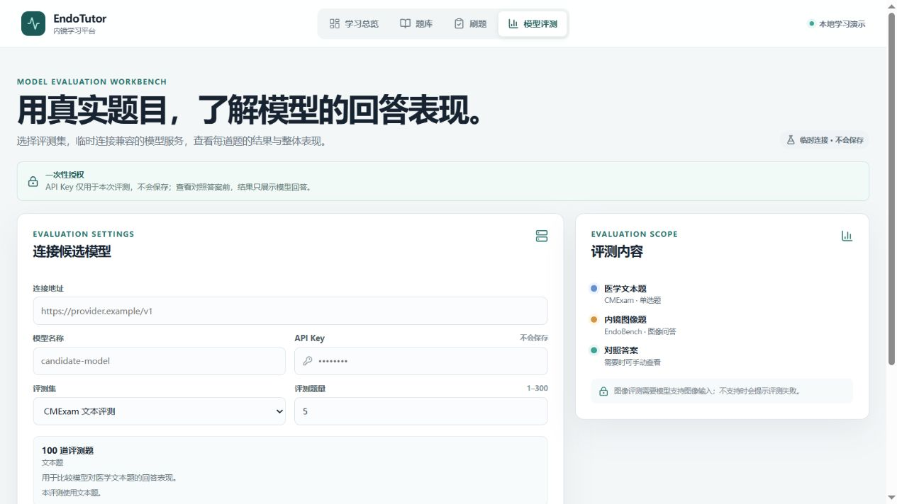

# EndoTutor v1.0.1

**Agent-native medical learning and assessment platform** for endoscopy education: real question banks, a continuous Tutor chat, adaptive practice and review, knowledge-grounded explanations, question generation, and model evaluation.

> 教学研修与医生复核前辅助，不作为独立诊断依据。



## What a learner can do

- Start with a compact checked-in teaching seed for local verification; use governed, locally authorized source data only as an optional import-validation fixture.
- Practice in Study, Exam, or Review mode with a persistent desktop Tutor sidecar.
- Submit an answer, receive feedback, and let the next practice session prioritize review due dates, weak topics, and coverage.
- Upload an allowed Markdown/PDF teaching document, generate a reviewable question draft, and publish only after review.
- Temporarily connect a compatible model to compare text or image-question results without storing its API key.

| Practice + Tutor | Adaptive learning loop |
| --- | --- |
|  |  |

| Question Factory | Model evaluation |
| --- | --- |
|  |  |

## Architecture

```text
React + Vite + TypeScript
          │ generated OpenAPI client / SSE
FastAPI ──┼── PostgreSQL: canonical learning, citation, and job state
          ├── Qdrant: retrieval index
          ├── Redis + Dramatiq: durable Factory jobs
          ├── bounded Tutor runtime: tools, permissions, retry, cancel, trace
          ├── Question Factory: Generator → gate → Judge → repair → publish
          ├── py-fsrs: review scheduling
          └── isolated BYOK evaluation domain
```

The Tutor has read-only tools. Successful submission deterministically executes
`grade → Attempt → mastery → review scheduling`; a model never writes learner state.
The Factory's backend and worker share a durable upload volume so a queued job can
read the exact document recorded by the API.

## Retrieval and adaptive learning

Dense retrieval is the v1.0 Tutor default. On the frozen portfolio engineering
benchmark, it provided the selected quality/latency trade-off among the default
paths; sparse, hybrid, and hybrid+rerank remain implemented and benchmarkable.
This is not a claim that Dense is universally superior. See
[the RAG benchmark](./docs/evals/rag-benchmark-v2.md).

The adaptive-loop artifact demonstrates the full state transition from a deliberate
mistake to a weak-topic next-session recommendation:
[adaptive-loop-demo-v1.json](./artifacts/learning/adaptive-loop-demo-v1.json).

## Quick start

Requires Python 3.12+, Node.js 22+, Docker Desktop, and npm.

```powershell
docker compose up --build
```

This starts frontend, backend, PostgreSQL, Qdrant, Redis, and the Dramatiq worker
with the compact teaching seed. It does not redistribute or require a large
third-party QBank. To exercise a locally authorized import fixture, explicitly
set `ENDO_DEMO_QBANK_BOOTSTRAP=true` and configure the ignored local data paths
in `.env`. The product direction is governed user/organization-owned source
upload rather than a platform-owned public dataset catalogue. Never commit keys
or local data roots.

## Verification

```powershell
# Backend
cd backend
$env:PYTHONPATH='.'
$env:TUTOR_PROVIDER_ENABLED='false'
python -m pytest -q

# Frontend
cd ../frontend
npm run api:check
npm run lint
npm test -- --run
npm run build
npx playwright test e2e/core-flow.spec.ts --grep 'Flow A:' --project=chromium
```

`npm run api:generate` deterministically rebuilds
`frontend/src/api/generated.ts` from FastAPI OpenAPI. The checked-in GitHub
Actions workflow is named **EndoTutor fast profile**. Its hosted promotion run
for commit `86fb139` passed backend, frontend, and Playwright Flow A:
[run 33296518709](https://github.com/Luious-LYH/TiBan/actions/runs/33296518709).

## Evidence and limits

- [Stage 4 v1.0 final report](./docs/stages/stage-4-v1.0-final-report.md)
- [Final evidence matrix](./docs/portfolio/FINAL_EVIDENCE_MATRIX.md)
- [90-second demo script](./docs/portfolio/DEMO_SCRIPT.md)
- [Data attribution and license boundaries](./THIRD_PARTY_DATA.md)
- [Security notes](./SECURITY_NOTES.md)

RAG and Question Judge human review remains deferred from v1.0 and is documented
only in evidence materials. It is not presented as expert or clinical validation.
EndoBench is evaluation-only and cannot enter Tutor knowledge, Factory sources, or
learner-facing QBanks. Raw chain-of-thought and secrets are neither displayed nor
persisted.

## License

Code follows the repository license. Third-party datasets are not redistributed;
their usage and attribution boundaries are recorded in
[THIRD_PARTY_DATA.md](./THIRD_PARTY_DATA.md) and `knowledge/registry/sources.yaml`.
