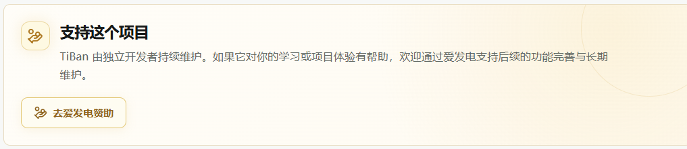

# 题伴 TiBan

### 面向多领域学习的 Agent-native 智能学习工作台

让题库、智能辅导、知识检索与复习调度围绕学习者持续协同，
把每一次作答都沉淀为下一步更合适的学习行动。

中文 | [English](./README.en.md) | [赞助](#支持-tiban)🚀

  

## TiBan 是什么 ？

TiBan 是一个把题库、学习资料、智能辅导和长期学习状态连接起来的自适应学习平台。学习者可以按领域选择题库，进入刷题或考试，在同一个专注的工作区完成作答、查看解析、追问难点，并在之后继续从上次的学习轨迹出发。

它同时面向个人学习与专业训练场景：医学 Demo Domain Pack 展示完整的专业学习体验，平台的题库、学习状态、知识库与 Agent 能力可以沿用到其他学科领域。

## 一条会持续积累的学习路径

~~~text
选择题库
   ↓
刷题 / 考试
   ↓
作答、解析与智能辅导
   ↓
掌握度 · FSRS 复习 · Learning Memory
   ↓
更有针对性的下一次练习
~~~

提交答案后，TiBan 会沿着服务端学习工作流记录 Attempt、更新掌握度、安排 FSRS 复习，并整理学习记忆。错题、待复习题和题库进度始终与真实作答保持一致，学习过程因此能够自然延续。

## 核心体验

| 模块 | 学习者可以做什么 | 核心能力 |
| --- | --- | --- |
| 题库与题目状态 | 按领域选择题库，查看规模与已做、未做、错题、标记状态 | Domain Pack、持久化进度、题目状态投影 |
| Practice + 智能辅导 | 在同一工作区完成作答、即时查看解析，并围绕当前题目提问 | 上下文感知 Tutor、SSE 流式交互、受控工具路由 |
| 带教 Agent | 回顾跨题库作答与复习轨迹，获得学习规划和知识问答 | 持久化会话、Learning Memory、Review Queue、只读学习工具 |
| 知识库 | 上传并管理 PDF、DOCX、Markdown、TXT，控制资料是否参与检索 | 解析、分段、版本化索引、Qdrant 语义检索 |
| 题库导入 | 校验已有题库，或从教学资料生成可审核的题目草稿 | CSV / JSONL / Markdown、质量门禁、审核发布流水线 |
| 评测实验室 | 在冻结的评测集上比较模型表现与 RAG 检索方案 | EvalSuite、可恢复后台任务、版本化 RetrievalProfile |

## 产品界面

下面的界面来自 TiBan 当前版本，覆盖从选题、刷题、复盘到 Agent 与评测的主要体验。

### 刷题与智能辅导

题目、选项、作答反馈、解析与智能辅导集中在同一工作区。Tutor 能够理解当前题目和学习上下文，在需要资料支持时给出有出处的回答。

### 题库选择与题目状态浏览

<table>
  <tr>
    <td width="50%"><strong>题库</strong> </td>
    <td width="50%"><strong>题库详情与状态</strong> </td>
  </tr>
</table>

### 带教 Agent：从一次作答看到长期成长

带教 Agent 跨题库读取近期作答、错题、复习队列、题库进度、学习记忆与已启用资料，帮助学习者梳理当前状态并规划下一步。

  

### 知识库：让资料成为可调用的学习上下文

用户资料经过解析、分段与索引后进入独立的知识管理空间。每份资料都拥有自己的状态与版本，学习者可以控制启停、查看解析结果，并为 Tutor 与带教 Agent 提供稳定的知识来源。

  

### 评测实验室：用可复现的条件比较模型与检索

评测实验室冻结同一批题目、Prompt 与运行条件，支持模型评测和 RAG 评测。结果保留题库、评测集与运行配置的上下文，便于对模型调用质量和检索策略进行清晰比较。

  

### 题库导入与学习配置

<table>
  <tr>
    <td width="50%"><strong>题库导入</strong> </td>
    <td width="50%"><strong>设置</strong> </td>
  </tr>
</table>

### 错题与复习

FSRS 复习调度和真实作答记录共同构成 Review Queue，学习者可以在待复习、错题与已标记之间切换，并直接查看题目详情与官方解析。

  

## 技术亮点

### Agent-native 学习工作流

- **Context-aware Tutor**：请求携带当前题目、练习模式、作答阶段和会话上下文，Study、Exam、Review 使用清晰的行为边界。
- **受控知识检索**：普通知识直接回答，真正需要资料时才触发 <code>search_knowledge</code>；召回结果经过领域、命名空间、相关性和去重处理。
- **可追溯引用**：回答中的资料出处与知识源、章节和片段关联，学习者可以沿着回答回到原始上下文。
- **Persistent Learning Memory**：从真实 Attempt、复习事实和学习对话中整理长期记忆，为下一次学习提供连续上下文。
- **FSRS 调度**：每次提交都会进入复习安排，学习节奏由真实掌握变化持续调整。

### 可靠的内容与评测基础设施

- **Domain Pack 架构**：领域内容、术语与安全策略由 Domain Pack 承载，学习引擎和 Agent 能力保持跨领域复用。
- **Durable Question Factory**：资料解析、题目生成、质量检查、修订、审核和发布拥有明确状态，后台任务支持追踪与恢复。
- **Reproducible Evaluation Lab**：EvalSuite 固定题目、Prompt 与运行条件；模型评测使用 <code>temperature=0</code> 与 no-fallback，RAG 评测复用产品运行中的同一套 <code>RagService</code>。
- **端到端类型契约**：React 前端通过生成的 OpenAPI Client 与 FastAPI 服务端通信，SSE 为 Tutor 与后台任务提供流式状态更新。

## 技术栈

~~~text
React 19 + TypeScript + Vite
        │  Generated OpenAPI Client + SSE
        ▼
FastAPI + Pydantic + SQLAlchemy
        ├─ PostgreSQL：题库、作答、复习、知识源与任务状态
        ├─ Qdrant + BGE-M3：知识检索与学习记忆语义索引
        ├─ Redis + Dramatiq：题库导入、索引与记忆整理后台任务
        ├─ py-fsrs：复习调度
        └─ OpenAI-compatible Providers：模型调用与评测
~~~

## 快速开始

环境要求：Python 3.12+、Node.js 22+、npm 和 Docker Desktop。

~~~powershell
git clone https://github.com/Luious-LYH/TiBan.git
cd TiBan
docker compose up --build
~~~

启动后访问 http://127.0.0.1:5173/，推荐按下面的顺序体验：

~~~text
/banks → 题库详情 → 开始刷题 → Practice + 智能辅导 → 提交答案 → 错题与复习
~~~

本地回归命令：

~~~powershell
# Backend
cd backend
$env:PYTHONPATH='.'
python -m pytest -q

# Frontend
cd ../frontend
npm run api:check
npm run lint
npm test -- --run
npm run build
~~~

## 数据与安全

- 大型第三方题库只在获得授权的本地环境中导入，不随公共仓库分发。
- API Key 保存在本地环境配置或请求级运行时配置中，不写入浏览器存储、数据库、日志或 Git。
- 知识资料拥有独立的来源、版本、解析片段和启停状态，便于管理 Agent 可以使用的内容范围。
- 医学 Demo 输出保留医生复核要求和安全提示，用于教学训练与医生复核前辅助。

数据来源与授权边界见 [THIRD_PARTY_DATA.md](./THIRD_PARTY_DATA.md)。

## 项目文档

- [项目总览](./docs/portfolio/PROJECT_OVERVIEW.md)
- [TiBan Demo Flow](./docs/v3/portfolio/V3_DEMO_FLOW.md)
- [智能辅导与带教 Agent 架构](./docs/architecture/tutor-agent.md)
- [题库导入架构](./docs/architecture/question-factory.md)
- [知识检索管线](./docs/architecture/rag-pipeline.md)
- [领域包与共享核心](./docs/architecture/domain-packs-v2.md)
- [数据来源与许可边界](./THIRD_PARTY_DATA.md)

## 支持 TiBan

TiBan 由个人持续维护。如果这个项目对你的学习、研究或项目实践有所帮助，欢迎通过[爱发电支持 TiBan](https://afdian.com/a/tiban)，帮助项目持续完善。
