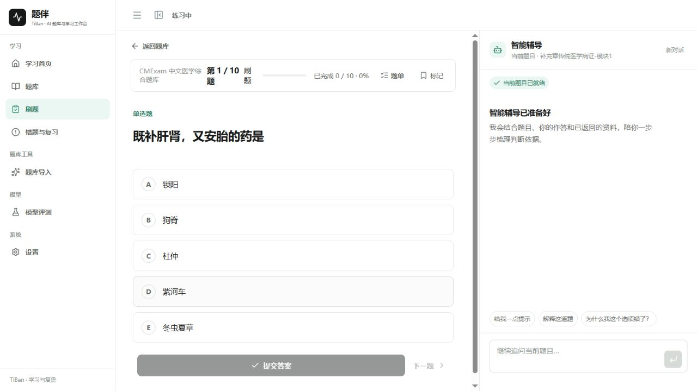
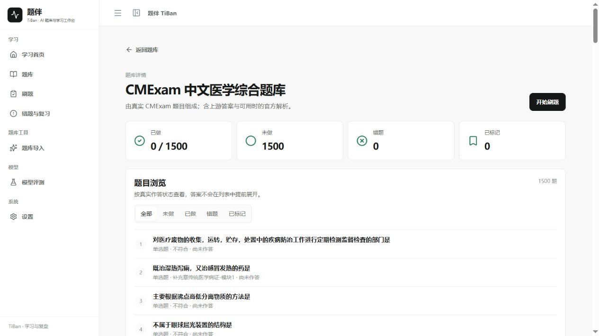
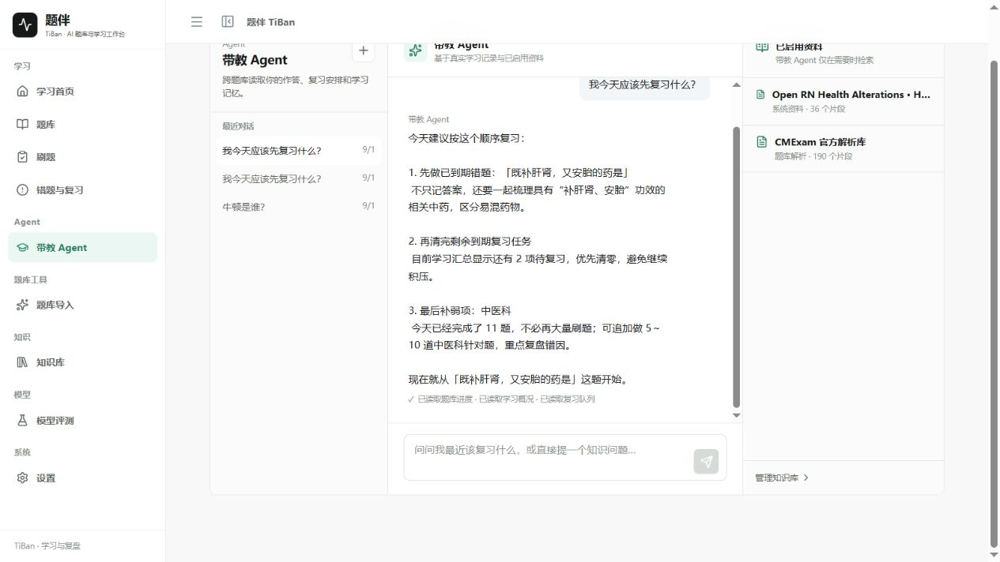
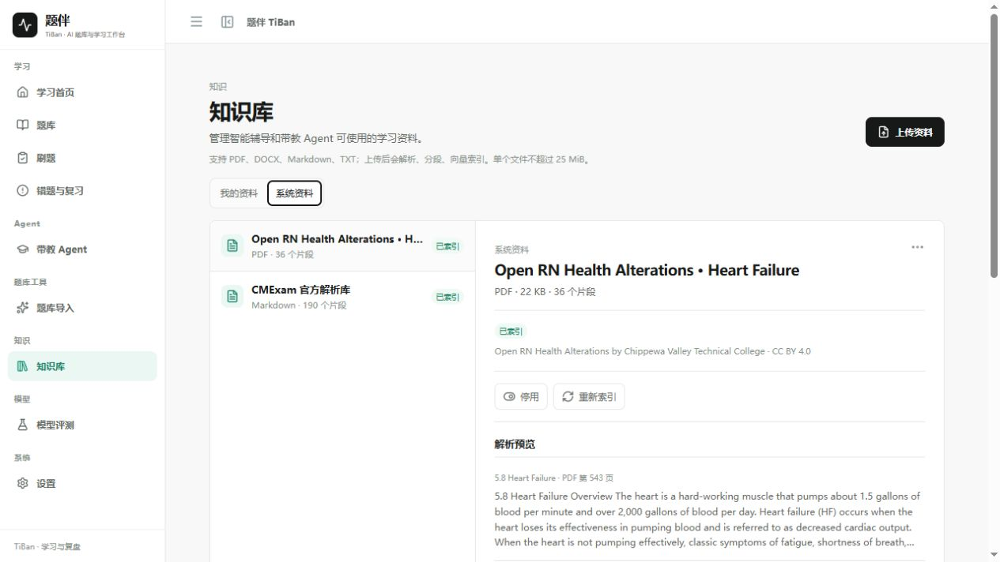

<div align="center">

# 题伴 TiBan

**Agent-native 自适应题库与学习工作台**

从刷题、智能辅导到复盘与知识检索，把学习状态真正连接起来。

[中文](#中文) · [English](#english)

</div>

> 当前公开分支：`refactor/v3-tiban-agent-experience`。本 README 默认展示中文产品说明；English 版本见文末。



## 中文

### TiBan 解决什么问题

TiBan 面向消化内镜研修场景，将题库、Practice、智能辅导、受治理知识检索、作答记录、掌握度、FSRS 复习调度、题库导入和模型评测组织成一条可追踪的学习闭环。

它的核心不是把聊天窗口放进题库，而是让辅导智能体理解当前题目、遵守 Study / Exam 权限边界，并在真实资料命中时给出可核验的来源。

### 一条真实学习路径

```text
题库详情
   ↓ 选择刷题 / 考试
Practice + 智能辅导
   ↓ 提交答案
Attempt → 掌握度 → FSRS Review Queue → Learning Memory
   ↓
错题与复习 / 带教 Agent
```

### 当前可展示的核心能力

| 能力 | 用户能看到什么 | 关键实现 |
| --- | --- | --- |
| 刷题与考试 | 题库详情、全部/未做/已做/错题/标记、轻量题单、提交反馈 | FastAPI practice workflow、Attempt、mastery、FSRS |
| 智能辅导 | 当前题目上下文、对话、真实检索状态、引用与流式活动 | 受控 Tool Registry、SSE、RAG relevance gate |
| 带教 Agent | 跨会话查看最近作答、复习队列、题库进度和学习记忆 | 持久化对话、只读学习工具、真实 runtime context |
| 题库导入 | 导入已有题目，或从资料生成可审核题目草稿 | CSV/JSONL/Markdown validate、解析、生成、Gate/Judge/Repair |
| 知识库 | PDF、DOCX、Markdown、TXT 的解析、索引、启停与来源预览 | FastEmbed + Qdrant + source/version/chunk registry |
| 模型评测 | Retrieval / 辅导评测中的真实 case、指标和 evidence | 冻结 artifact、typed API projection、隔离评测数据 |

### 真实界面证据

以下截图来自本地真实运行页面，不是设计稿或 mock screenshot。

<table>
  <tr>
    <td width="50%"><strong>Practice + 智能辅导</strong><br></td>
    <td width="50%"><strong>题库详情与状态浏览</strong><br></td>
  </tr>
  <tr>
    <td width="50%"><strong>带教 Agent：跨会话学习上下文</strong><br></td>
    <td width="50%"><strong>知识库：真实资料与索引状态</strong><br></td>
  </tr>
</table>

更多真实验收截图：

- [Practice + Citation](./docs/v3/evidence/rc-promotion/01-practice-rag-citation-1440.png)
- [题库导入 / Question Factory](./docs/v3/evidence/rc-promotion/03-factory-real-job-1440.png)
- [模型评测 evidence](./docs/v3/evidence/rc-promotion/04-evaluation-evidence-1440.png)
- [设置与实例级智能服务配置](./docs/v3/evidence/rc-promotion/07-settings-1440.png)

### 技术主线

```text
React 19 + TypeScript + Vite
            │ typed OpenAPI client / SSE
FastAPI ────┼── PostgreSQL：题目、作答、复习、知识源与任务状态
            ├── Qdrant：受治理知识检索
            ├── Redis + Dramatiq：持久化题库导入任务
            ├── 辅导智能体：受控工具、权限、流式事件和可审计结果
            ├── Question Factory：Parse → Generate → Gate → Judge → Repair → Review → Publish
            └── py-fsrs：复习调度
```

前端通过生成的 OpenAPI client 访问后端，运行时状态以 API、数据库和 artifact 为准；`frontend/src/api/generated.ts` 不手工维护。

### 安全与数据边界

- 医疗 / 消化内镜是主要教学领域，所有医疗辅助输出保留医生复核边界。
- Tutor / 带教 Agent 只能读取当前允许的题目、学习者状态和知识源，不编造图像依据。
- EndoBench 只属于 Evaluation，不进入 Tutor、题库或题目生成链路。
- 大型第三方题库与用户上传资料不随仓库分发；来源、许可和复用边界见 [`THIRD_PARTY_DATA.md`](./THIRD_PARTY_DATA.md)。
- API Key 不存入浏览器；实例级智能服务配置通过运行时设置影响后端，重启后恢复 `.env` / Docker 默认值。

### 快速开始

环境要求：Python 3.12+、Node.js 22+、npm、Docker Desktop。

```powershell
docker compose up --build
```

启动后访问 `http://127.0.0.1:5173/`，推荐按以下顺序体验：

```text
/banks → /banks/:bankId → /practice → 提交答案 → /review
```

题库导入、知识库、带教 Agent、模型评测和设置是独立的次级演示入口。

本地回归：

```powershell
# Backend
cd backend
$env:PYTHONPATH='.'
python -m pytest -q

# Frontend
cd ../frontend
npm run api:check
npm run lint
npm test -- --run
npm run build
```

### 项目文档

- [项目总览](./docs/portfolio/PROJECT_OVERVIEW.md)
- [Demo Flow](./docs/v3/portfolio/V3_DEMO_FLOW.md)
- [带教智能体与智能辅导架构](./docs/architecture/tutor-agent.md)
- [Question Factory 架构](./docs/architecture/question-factory.md)
- [领域包与共享核心](./docs/architecture/domain-packs-v2.md)
- [V3.1 功能闭环与 Learning Agent 报告](./docs/v3/V3_1_LEARNING_AGENT_CLOSURE_REPORT.md)
- [V3 RC Promotion 报告](./docs/v3/V3_RC_PROMOTION_REPORT.md)
- [公开 Evidence Matrix](./docs/portfolio/FINAL_EVIDENCE_MATRIX.md)
- [数据来源与许可边界](./THIRD_PARTY_DATA.md)

## English

### What is TiBan?

TiBan is an agent-native adaptive question-bank and learning workspace for endoscopy education. It connects question banks, Practice, a persistent learning assistant, governed knowledge retrieval, attempts, mastery, FSRS scheduling, question import, and model evaluation into one auditable loop.

The product is not a chat box placed next to a quiz. The learning assistant receives the current question context, respects Study / Exam permission boundaries, and cites governed sources only when retrieval produces relevant evidence.

### Core experience

- **Practice and Exam** — browse bank details and question states, answer questions, submit without waiting for the LLM, and continue through Attempt, mastery and FSRS scheduling.
- **Persistent learning assistant** — keeps the current question in context, exposes retrieval state and inline citations, and streams controlled activity through SSE.
- **Coach Agent** — reads recent attempts, review queue, bank progress and learning memory across sessions through read-only tools.
- **Question import** — validate an existing CSV/JSONL/Markdown bank or turn an allowed teaching document into a reviewable draft.
- **Knowledge library** — parse, index, enable/disable and preview PDF, DOCX, Markdown and TXT sources with provenance.
- **Model evaluation** — project real retrieval and tutoring artifacts into understandable cases, metrics and evidence.

### Architecture

TiBan uses React 19, TypeScript, Vite, FastAPI, PostgreSQL, Qdrant, Redis/Dramatiq, FastEmbed, SSE and `py-fsrs`. OpenAPI types are generated from the FastAPI contract. Runtime truth stays in the API, database and evaluation artifacts rather than in frontend-only mock state.

### Quick start

Requirements: Python 3.12+, Node.js 22+, npm and Docker Desktop.

```powershell
docker compose up --build
```

Open `http://127.0.0.1:5173/` and follow `/banks` → `/banks/:bankId` → `/practice` → submit → `/review`.

See the [Demo Flow](./docs/v3/portfolio/V3_DEMO_FLOW.md), [V3.1 closure report](./docs/v3/V3_1_LEARNING_AGENT_CLOSURE_REPORT.md), and [data attribution policy](./THIRD_PARTY_DATA.md) for details.

### Scope and safety

TiBan is for educational training and physician-review-before-use support. It is not an independent diagnostic or treatment system. EndoBench remains evaluation-only, and large third-party datasets and user uploads stay outside the public repository.

## License

Code follows the repository license. Third-party datasets and source documents retain their own attribution and reuse restrictions.
