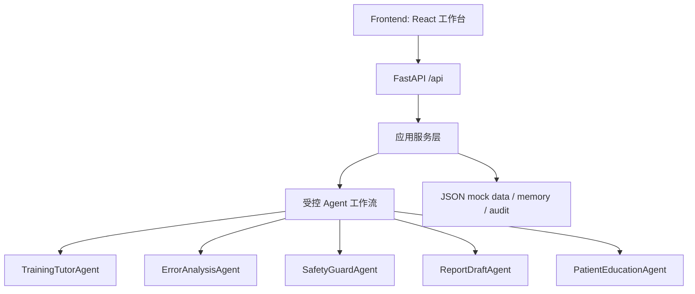

# ARCHITECTURE

## 四层结构

## 后端模块

- `question_service`: 题库读取和筛选。
- `grading_service`: 规则评分、错因标签、atomic feedback、下一题推荐。
- `tutor_orchestrator`: 提示、讲解、当前题 chat。
- `report_service`: 报告草稿和科普卡片。
- `skill_registry`: 受控技能注册和调用。
- `memory_service`: 学员画像、错题、能力分更新。
- `model_service`: 模型库 mock 与默认模型选择。
- `audit_service`: 关键事件持久化到 JSON。
- `safety_service`: 越界和敏感表达规则检查。

## 前端页面

- `/`: 首页总览
- `/training`: 三栏训练中心
- `/feedback`: 原子事实错因反馈
- `/false-premise`: 错误前提训练
- `/report`: 报告草稿
- `/card`: 科普卡片
- `/models`: 模型库与能力 mock 看板
- `/skills`: Skills 中心
- `/audit`: 审计日志

## 外部参考如何转化为产品设计

- HyperKvasir 启发题库覆盖解剖定位、正常/异常发现、图像质量和病灶属性。
- Kvasir-VQA-x1 启发复杂度分层、GI-VQA 任务结构和雷达图式能力展示。
- MediaEval Medico 2025 启发“答案 + 多模态解释 + 证据链”的反馈形式。

