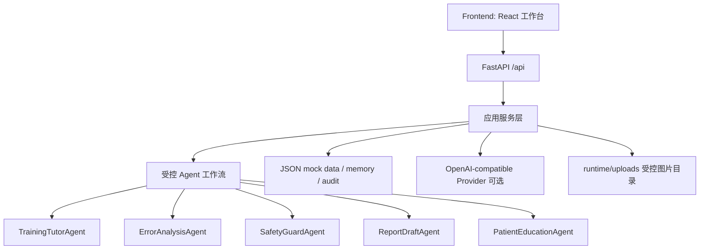

# ARCHITECTURE

## 四层结构

## 后端模块

- `question_service`: 题库读取和筛选。
- `grading_service`: 规则评分、错因标签、atomic feedback、下一题推荐。
- `tutor_orchestrator`: 提示、讲解、当前题 chat 和挑战基准；chat 可选调用 Provider 并回灌训练标签，`challenge_benchmark` 只在医师提交后调用，Provider 失败时回退公开标注 fallback，只写审计不重复更新画像。
- `report_service`: 报告草稿、报告修改评分和科普卡片；报告输出 `source_trace`、`evidence_ledger`、`generation_mode`，科普卡片生成草稿并通过同一 `card_id` 审核解锁，输出 `review_status`、`share_status` 和审核步骤。
- `llm_provider`: OpenAI-compatible `/chat/completions` 适配器；只允许公开样例图片和 `runtime/uploads` 受控图片进入视觉输入。
- `skill_registry`: 受控技能注册和调用。
- `memory_service`: 学员画像、错题、能力分更新。
- `model_service`: 模型库与样例级准入检查；最多 3 个公开样例逐条返回 evidence，真实 Provider 成功调用时 `provider_called=true`，否则为规则草案。
- `audit_service`: 关键事件持久化到 JSON。
- `safety_service`: 越界和敏感表达规则检查。

## 前端页面

- `/`: 首页总览
- `/training`: 三栏训练中心，包含练习、考试、错题/收藏和 `/training?view=challenge` 医生 vs 后端挑战基准
- `/feedback`: 原子事实错因反馈
- `/false-premise`: 错误前提训练
- `/report`: 报告中心，支持公开样例、图片上传、结构化草稿、来源追踪和报告修改评分
- `/card`: 科普卡片，支持草稿生成、医生审核闸门、审核后打印/分享解锁
- `/models`: 模型准入与测试中心，展示后端 Provider 状态、样例级 Provider evidence 和规则草案
- `/skills`: Skills 中心
- `/audit`: 审计日志

## 外部参考如何转化为产品设计

- HyperKvasir 启发题库覆盖解剖定位、正常/异常发现、图像质量和病灶属性。
- Kvasir-VQA-x1 启发复杂度分层、GI-VQA 任务结构和雷达图式能力展示。
- MediaEval Medico 2025 启发“答案 + 多模态解释 + 证据链”的反馈形式。

## v2.0 真实性分层

| 层级 | 说明 | UI 展示 |
|---|---|---|
| `provider` | 后端已配置 `.env` 或请求级临时配置，成功调用 OpenAI-compatible Provider | 绿色 Provider badge、延迟、样例 evidence |
| `rule` | 未配置 Provider，后端规则/模板生成 | 蓝色 rule badge、来源追踪显示 Provider 未使用 |
| `fallback` | Provider 调用失败或前端无法连接后端 | amber fallback badge、错误原因 |

## 医疗安全边界

- 所有模型输出都是医生审核前教学辅助，不签发最终诊断。
- 公开样例标注不写入“医生输入所见”，只作为 `public_sample_annotation` 来源。
- 上传图片保存到 `backend/runtime/uploads`，不会提交 git；Provider 只读取受控目录中的图片。
- 模型准入不保存 API key，不在审计日志输出密钥。
