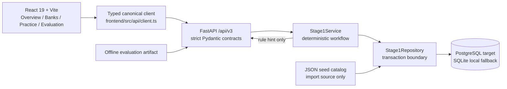
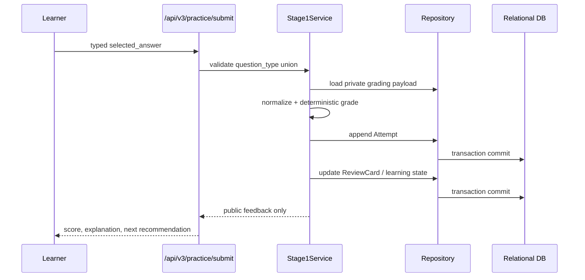

# EndoTutor Stage 1 System Architecture

## Scope

Stage 1 closes the three boundaries that were previously drifting: public question contracts, runtime persistence, and the four-page learning product. The existing legacy portfolio routes remain available for migration compatibility, but the main product route only calls `/api/v3`.

## Runtime topology



The intended production storage is PostgreSQL through SQLAlchemy 2 and Alembic. This checkout uses SQLite for local execution because no PostgreSQL server/container is available in the current environment. The database URL is selected by `ENDO_DATABASE_URL` or `DATABASE_URL`.

## Contract boundary

`backend/app/schemas/stage1.py` defines four named trust-boundary contracts:

- `QuestionPublic`: a discriminated union of `single_choice`, `multiple_choice`, `true_false`, and `short_answer` public variants.
- `QuestionForGrading`: the same four-way discriminator with server-only grading payloads.
- `QuestionAdmin` and `QuestionDraft`: explicit private/admin aliases kept separate from public response usage.

Public choice options contain stable `{id, text}` values. Answers and grading fields are stored in `questions.grading_payload` and are only materialized inside the submit service. The pre-submit response path projects through `public_question_payload` and rejects extra fields.

## Deterministic submit workflow



The LLM is not responsible for `update_learning_state`, review scheduling, or other deterministic side effects. Tutor v1 is represented by the explicitly labeled rule-hint endpoint; the Agent Harness remains a later-stage scope item.

## Persistence model

```text
question_banks  1 ─── * questions
question_banks  1 ─── * practice_sessions
practice_sessions 1 ─── * attempts
questions       1 ─── * attempts
questions       1 ─── * review_cards (unique per learner/question)
question_banks  1 ─── * source_documents (optional)
```

Stage 1 migration `0001_stage1_core` creates only these six entities and their query indexes. JSON remains valid for seed, fixture, import/export, and frozen evaluation artifacts; it is not used as the runtime submit store.

## Frontend component tree

```text
src/
├── App.tsx
├── app/
│   ├── AppShell.tsx
│   ├── providers.tsx
│   └── router.tsx
├── api/
│   ├── client.ts
│   └── generated.ts
├── components/shared/
│   └── AsyncState.tsx
├── pages/
│   ├── overview/OverviewPage.tsx
│   ├── banks/BanksPage.tsx
│   ├── practice/PracticePage.tsx
│   └── evaluation/EvaluationPage.tsx
└── test/
    └── core-pages.test.tsx
```

The primary UI uses CSS variables/design tokens, Lucide, TanStack Query, and a single typed API boundary. The pre-existing top-level legacy pages and clients are out of the new router and ignored by Stage 1 lint while migration is in progress.

## Deferred by design

- PostgreSQL runtime verification requires a reachable PostgreSQL service.
- AgentRunner/ToolRegistry/ModelGateway and Langfuse integration remain Stage 2/observability work.
- Qdrant retrieval and sparse/dense/hybrid benchmark artifacts remain Phase 5 work.
- AI Question Factory and authoring flows are not part of the Stage 1 learning path.
