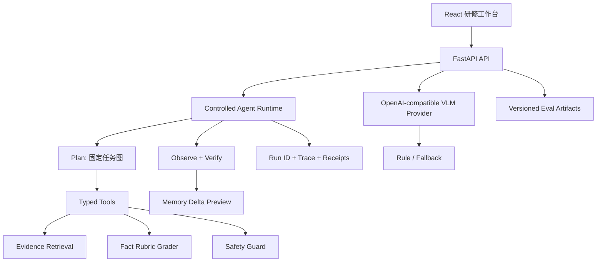

# 项目定位与架构

## 重构前的问题

旧版本页面和功能较多，但核心能力呈现为“聊天框 + 表单”；模型选择主要改变前端标签，模型评分存在演示占位，题目也偏 Benchmark 模板。它适合作为竞赛 Demo，却不适合作为 Agent 岗作品集。

## 重构后的双主线

### Agent 应用岗

主演示是内镜研修：病例图像与圈画 → 医生作答 → Agent 规划和工具执行 → 证据复盘 → 画像 Delta → 下一题/报告交接。

### 大模型算法岗

主演示是实验评测：固定数据版本 → 模型推理 → 事实级指标与错误类型 → 延迟/吞吐/显存 → 可复现 Artifact。Agent 系统作为模型落地能力加分项。

## 架构

## 关键工程决策

- 使用受控状态图，不允许模型自由发明医疗工具或临床动作。
- 工具输入输出由 Pydantic 模型约束，并返回 `call_id`、耗时和 `evidence_ids`。
- Provider、Rule、Fallback 在 API 与 UI 中显式区分。
- Seed 与运行态分离；画像、审计和模型状态写入 `backend/runtime/data`。
- 模型页不再展示没有 Artifact 的历史占位分数。
- Agent Eval 与模型 Eval 分开，避免把规则回归率误写成模型准确率。

