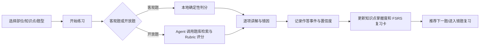

# v2.2 问题归纳、参考调研与后续改造规划

> 状态：规划文档。本文只归纳问题和锁定后续改造方向，不在本轮修改代码。
>
> 目标产品：**内镜医师刷题 Agent**，即“真实题库业务 + Agent 陪练/讲题/错题复习 + 可复现模型评测”。
>
> 适用对象：研三求职作品集、面试展示和后续迭代。不是临床诊断系统，也不把公开 benchmark 包装成临床题库。

## 0. 先给结论

当前 v2.1 的根问题不是颜色、间距或某一个按钮，而是产品主线偏了：

1. **产品身份偏成了“病例报告描述 Demo”**，而用户真正要展示的是“内镜医师刷题软件”。
2. **题库以病例卡片为单位，而不是以题目/知识点为单位**；用户看见 5 个病例，自然会认为只有 5 道题。
3. **后端存在练习 API 和 50 条派生变体，但没有成为前端主流程**；派生题也不是医生编审的正式题目。
4. **Agent 目前更像固定的规则运行器**：能记录步骤和收据，但没有围绕“选题—提示—讲题—评分—复习—记忆”完成用户价值闭环。
5. **开放题评分没有真正的题库知识库 RAG 链路**；当前小语料稀疏匹配不能回答“为什么这样评分、依据来自哪里、如何避免答非所问”。
6. **评测能力没有成为用户可操作的产品**；有自定义模型 API 的后端入口，但当前主导航和评测页没有让用户选择评测集、输入一次性授权、真实调用并查看逐题结果。
7. **内部工程术语泄漏到用户界面**，如 Run、Receipt、Memory、Context budget、Precision/Recall；这些可以留在“查看运行详情”里，不能作为刷题主界面语言。

后续所有改造都围绕一个成功时刻：

> 研修医选择一个部位和知识点 → 完成单选/多选/判断/问答 → Agent 根据题目和知识库给出逐项讲解 → 更新掌握度和下次复习时间 → 推荐下一道真正相关的题。

## 1. 当前 v2.1 的事实盘点

| 维度 | 当前事实 | 用户感知 | v2.2 目标 |
|---|---|---|---|
| 题库展示 | `portfolio_cases.json` 有 5 个病例；`real_sample_knowledge.json` 有 10 张公开样例图 | 只有 5 个“病例”，不像题库 | 按题库/部位/知识点展示题量，病例只是题目素材的一种载体 |
| 练习变体 | 后端 `/api/practice/questions` 可由 10 张图派生约 50 条变体 | 入口没有题型筛选，能力像不存在 | 以正式 `question_id` 为核心，支持题型、难度、知识点、错题和收藏筛选 |
| 题型 | 后端已有单选、多选、判断、问答评分、报告修改字段，但前端主入口不承载它们 | 用户只能写一段自由文本 | 单选、多选、判断为主；问答、配对、填空、图像定位作为扩展 |
| 内容来源 | 题目由 benchmark QA 和规则模板派生 | 看起来像测模型，不像医生培训题 | benchmark 与教学题库分离；教学题由知识点、教学目标、干扰项和参考资料组成 |
| Agent | 固定 `retrieve_case_evidence → fact_rubric_grader → safety_guard` | 有运行日志，但没有明显的“陪练老师”价值 | Agent 按学习意图选择提示、讲题、评分、复习和记忆工具 |
| 评分 | 小语料 BM25-equivalent + 关键词事实命中 | 开放题可能只是在匹配词 | 客观题确定性评分；主观题采用 Rubric + 知识库证据 + LLM judge 二次评分 |
| RAG | 没有题库知识库的向量索引、分块、混合召回和重排 | 不能解释知识依据 | 题目/讲义/参考资料分库，dense+sparse+rerank，返回可读证据片段 |
| 记忆 | 有运行态画像和少量复习字段 | 看不出长期带教 | 分离会话记忆、作答事件、学习画像、长期知识点记忆和复习卡状态 |
| 模型评测 | 后端有 `/api/models/custom-evaluate`，当前主 UI 没有完整入口 | 用户不能选择 API、评测集并确认真实调用 | BYOK 一次性调用，隐藏答案，逐题记录响应、评分、延迟和失败原因 |
| 用户语言 | 页面中出现 Agent Runtime、Receipt、Memory、Context budget 等开发词 | 像工程验收台，不像刷题软件 | 主界面只说“提示、讲解、复习、掌握度”；高级运行信息折叠展示 |
| 图像 | 图片来源真实，但题卡图像尺寸和信息层级不够统一 | 视觉上像样例列表 | 统一比例、contain、放大、缩略图、加载/失败/无图状态 |
| 工程结构 | `api.ts` 与 `v3Api.ts` 有重复能力；旧页面代码存在但不在主路由 | 维护和接手困难 | 一个 API client、一个题库模型、一个评测模型、一个版本化数据源 |

## 2. Scope Lock：先锁产品范围

### 2.1 产品承诺

**为消化内镜研修医提供可持续刷题和错题复习。Agent 负责理解学习意图、给提示、逐项讲解、对开放回答按题目 Rubric 评分、更新知识点掌握度并安排复习；模型评测是独立的研究入口。**

### 2.2 用户角色

- **研修医**：选题、作答、看讲解、复习错题、查看知识点薄弱项。
- **题库维护者/带教老师**：导入题目、维护参考资料、审核 AI 生成题、发布题库版本。
- **模型评测者/面试官**：选择冻结评测集，输入自己的 OpenAI-compatible API，查看逐题结果和指标。

### 2.3 必须保留、删除、延后

**必须保留（MVP）**

- 食管、胃、小肠三个题库入口；预留结直肠、胶囊内镜、基础操作等大类。
- 单选、多选、判断、简答四种题型；至少展示题型筛选和题量。
- 今日练习、顺序练习、错题本、收藏、到期复习、练习记录。
- Agent 提示、逐选项讲解、开放题评分、复习计划和知识点掌握度。
- 题库导入/导出和题目校验；至少支持 JSONL/CSV/Markdown 模板。
- 独立的模型评测页：选择评测集、一次性输入 API、真实调用、逐题结果、汇总指标。

**从主流程删除或折叠**

- 把“器械异常分布、阴性发现计数、报告纠错”当成一级题库分类。
- 在用户主界面直接显示 `Plan/Act/Recovery/Observe/Verify/Memory`、Tool Receipt、token budget。
- 把 `Golden Case`、`Agent Run` 当成研修医必须理解的概念。
- 把所有开发验收、审计和模型 artifact 堆在研修首页。

**延后到增强版**

- 多人协作、排行榜、社交讨论、真实医院账号体系。
- 多 Agent 协作。先用一个带路由的 Tutor Agent 证明价值。
- 真实临床报告发布、患者端分享、自动诊疗建议。
- 复杂知识图谱和全量医学文献爬取。

### 2.4 主演示链路



## 3. 联网参考调研及可借鉴结论

### 3.1 刷题和记忆产品

- [Anki Getting Started](https://docs.ankiweb.net/getting-started.html)：Anki 把一组字段称为 note，再由 card type/template 生成一张或多张卡；这说明“题目内容”和“展示卡片”应该分离，而不是把所有信息塞进一个文本字段。
- [Anki Card Templates](https://docs.ankiweb.net/templates/intro.html)：模板控制字段在正面/背面如何呈现，可用于同一题生成识别卡、反向卡、填空卡或图像卡。
- [Anki Deck Options / FSRS](https://docs.ankiweb.net/deck-options.html#fsrs)：FSRS 以期望保留率为核心，并根据复习反馈调整间隔；不能只用“答错后固定 1 天”冒充完整记忆算法。
- [Moodle Question Types](https://docs.moodle.org/26/en/Question_types)：成熟题库通常支持单选/多选、判断、匹配、填空、数值、简答、Essay 等多题型，并允许图像或媒体进入题干和选项。
- [Dept. Q. Bank](https://github.com/znu-med/Dept-Q-Bank)：开源医学题库把模块、学科、考试类型、题目导航、标记、错题重做、结果解释和本地进度作为完整业务闭环；题目用 JSON 文件维护，新增模块不需要改代码。
- [ZeroQCM](https://github.com/KNIGHTABDO/zeroqcm)：值得借鉴 QCM/QROC、逐选项 AI 解释、流式讲解、书签和间隔复习；它体现的是“AI 解释服务刷题”，而不是用聊天代替刷题。
- [Stepwise QBank](https://github.com/yagamilight-pk/stepwise-qbank-complete)：值得借鉴 block builder、Timed/Exam/Adaptive 模式、题目 palette、错题/收藏、flashcard、分析页和题目导入管理；其仓库也明确区分演示数据与正式统计。

### 3.2 Agent、工具和可观测性

- [OpenAI practical guide to agents](https://openai.com/business/guides-and-resources/a-practical-guide-to-building-ai-agents/)：Agent 至少要有 model、tools、instructions，并且由模型根据工作流状态选择工具；单轮聊天不能自动称为 Agent。
- [Anthropic Building Effective Agents](https://www.anthropic.com/engineering/building-effective-agents)：应区分固定 Workflow 与动态 Agent；常见模式包括 routing、parallelization、orchestrator-workers、evaluator-optimizer，并强调工具说明和测试。
- [OpenAI Agents SDK tools](https://openai.github.io/openai-agents-python/tools/)：工具应有清晰 schema，既可以取数据，也可以执行动作；这适合把“提示、评分、更新复习计划”等做成有类型的工具。
- [OpenAI Agents SDK tracing](https://openai.github.io/openai-agents-python/tracing/)：完整 trace 应覆盖模型生成、工具调用、handoff、guardrail 和自定义事件；这些是面试展示证据，应该放在高级详情而不是用户主界面。

### 3.3 RAG、混合检索和评测

- [Qdrant Hybrid Search](https://qdrant.tech/documentation/search/text-search/hybrid-search/)：可以在同一个 collection 中存储 dense vector 和 sparse vector，兼顾语义相似和精确关键词。
- [LlamaIndex Node Parser](https://docs.llamaindex.ai/en/v0.10.18/module_guides/loading/node_parsers/root.html)：分块时继承 metadata，适合把部位、知识点、来源版本和题目 ID 绑定到每个 chunk。
- [LangChain ParentDocumentRetriever](https://reference.langchain.com/python/langchain-classic/retrievers/parent_document_retriever/ParentDocumentRetriever)：小 chunk 负责精准召回，parent document 负责把完整解释带回上下文，适合医学条目和题目讲解。
- [Cohere Rerank](https://docs.cohere.com/docs/rerank)：rerank 用 query 与候选文档的联合相关性排序，适合在 dense+sparse 候选之后减少噪声和 token。
- [Ragas metrics](https://docs.ragas.io/en/latest/concepts/metrics/available_metrics/)：RAG 不应只看最终答案，至少要看 Context Precision、Context Recall、Faithfulness、Answer Relevancy；Agent 还可看 Tool Call Accuracy、Tool Call F1 和 Goal Accuracy。

### 3.4 内镜数据和评测边界

- [Kvasir-VQA official repository](https://github.com/simula/Kvasir-VQA)：公开数据包含图像—问答标注，适合 VQA/模型实验；它的 QA 是为视觉问答生成和评测服务的，不等于医生课程题库。
- [EndoBench official repository](https://github.com/CUHK-AIM-Group/EndoBench)：面向 MLLM 的内镜 benchmark，覆盖多个场景和任务，并明确要求遵守各原始数据集的 license。它应该进入“模型评测集”，而不是直接作为用户刷题首页。

**调研结论：**教学题库、Agent 知识库、模型 benchmark 必须是三套不同的数据契约；可以共享公开图像，但不能共享“展示目的、评分方式和用户语义”。

## 4. 问题清单与对应改造规划

以下每一项都包含：问题 → 为什么重要 → 计划怎么改 → 具体技术流程 → 面试追问和要拿出的证据。

### A. 产品定位和业务闭环

#### A1. 当前主流程不是刷题，而是写病例观察记录

**问题**

当前工作台要求用户输入一段“部位—黏膜—阴性发现—复核边界”的描述。这个任务可以作为开放题，但不应该成为整个产品的默认题型。

**改造规划**

把工作台改成标准练习会话：顶部显示“胃｜病变识别｜单选｜第 3/10 题”，中间是图像和题干，底部是选项/输入框；提交后才打开 Agent 讲解区。

**技术流程/栈**

`session_start → question_selector → question_renderer → submit_answer → grader → tutor_explanation → scheduler → next_question`。

前端 React + TypeScript；后端 FastAPI + Pydantic；会话状态存 PostgreSQL/SQLite；实时讲解用 SSE；复杂 Agent 状态用 LangGraph checkpoint。

**面试追问与证据**

- 追问：为什么不是直接做聊天机器人？
- 证据：同一题可以走“提示、作答、逐项讲解、错题复习”四个明确动作；录制一次完整练习 trace，而不是只展示一段聊天。

#### A2. 病例、题目、知识点混为一个概念

**问题**

一张图被包装成一个病例卡片，再从图像答案派生多个变体；用户无法知道有几道正式题、每道题考什么、同一病例是否有 sibling cards。

**改造规划**

采用三层对象：

- `case`：一组图像/临床教学背景。
- `note`：围绕一个知识点的完整内容和参考资料。
- `question/card`：面向一次练习的具体题干、题型、答案和评分器。

一张病例图像可以承载 5 道不同题，但每道题有独立 ID、掌握度和复习记录。

**技术流程/栈**

数据库表 `cases`、`notes`、`questions`、`cards`、`knowledge_points`；`case_id` 只做素材关联，不作为练习主键。Anki-inspired sibling card 由 note template 生成，复习时可设置 sibling burying，避免连续暴露答案。

**面试追问与证据**

- 追问：为什么要分 note/card？
- 证据：同一 note 可生成“单选识别卡、反向定位卡、图像遮挡卡”；修改解释字段后相关 card 一起更新。

#### A3. 只有三个部位入口，且无法自然扩展

**问题**

食管、胃、小肠作为筛选项是合理的，但现在更像三个按钮，不是可扩展的题库目录。

**改造规划**

使用多级 taxonomy：

```text
消化内镜
├─ 食管：解剖标志、正常黏膜、炎症、息肉/隆起、狭窄、报告规范
├─ 胃：解剖分区、正常黏膜、糜烂/溃疡、息肉、出血、操作器械
├─ 小肠/十二指肠：部位定位、绒毛/黏膜、胶囊内镜观察
├─ 结直肠（预留）：息肉、腺瘤、炎症、分型
├─ 胶囊内镜（预留）：进镜顺序、部位和时间轴
└─ 基础操作（预留）：图像质量、视野、清洁度、器械识别
```

首页显示“已发布题数”和“待复习题数”；没有内容的目录显示“暂未发布”，不伪造题目。

**技术流程/栈**

`taxonomy.yaml` 作为版本化目录；题目用 `body_part_id`、`topic_id`、`knowledge_point_id` 关联。后端返回目录统计，前端不从标题猜部位。

**面试追问与证据**

- 追问：新加“结直肠”是否需要改前端代码？
- 证据：导入一个新 taxonomy 节点和题库 manifest 后，前端自动出现目录和题量。

### B. 题库内容和题型

#### B1. benchmark QA 被直接当成医生培训题

**问题**

Kvasir-VQA/EndoBench 适合模型 VQA 和 benchmark 评测；“是否有文字、数几个器械、异常在哪个区域”可以作为模型能力任务，但不等于完整的医生知识点教学。当前模板直接围绕这些答案派生题，容易被面试官问“医学教学目标是什么”。

**改造规划**

拆成三类数据集：

1. `teaching_qbank`：面向研修医，题干、知识点、干扰项、讲解和参考教材由人工编审。
2. `agent_knowledge`：用于提示和讲题的教学资料、术语表、常见错误。
3. `model_eval`：冻结 benchmark/holdout，答案隐藏，专供模型 API 评测。

公开图像只记录 `image_source`、license、citation 和使用范围。没有教学审核的 benchmark 题只标记为“研究评测”，不进入默认刷题计划。

**技术流程/栈**

`source_registry → content_normalizer → human_review_status → publish_version`；使用 JSON Schema 校验字段，题目状态包括 `draft/reviewed/published/deprecated`。发布时生成不可变 `bank_version` 和 manifest hash。

**面试追问与证据**

- 追问：你如何防止把模型 benchmark 包装成医学能力？
- 证据：页面分开显示“教学题库”和“模型评测集”，每个题库有来源、license、审核状态和适用范围。

#### B2. 题型过少且用户不能选择

**问题**

用户期待单选、多选、判断等基本刷题形式；当前这些字段在后端存在，但当前主入口未呈现。

**改造规划**

MVP 题型：

- 单选：一个正确选项，支持图像和媒体。
- 多选：多个正确选项，按集合评分，并显示漏选/误选。
- 判断：判断一个医学陈述是否被题干资料支持。
- 简答：输入观察或知识点答案，由 Rubric 评分。

增强题型：配对、填空、数值/计数、图像热点/遮挡、病例时间线。报告改写只能作为“表达训练”子类，不再作为题库主导航。

**技术流程/栈**

`QuestionType` 使用 discriminated union；每种题型有独立 renderer、validator、grader 和 result view。后端不再依靠 `options` 字符串猜题型。

**面试追问与证据**

- 追问：多选怎么处理部分正确？
- 证据：展示 `precision/recall/F1` 或“漏选 1 项、误选 1 项”，并明确最终得分规则，而不是简单判断整串字符串相等。

#### B3. 干扰项质量不足

**问题**

模板式选项很容易出现“最长的就是正确答案”“一眼看出越界选项”“选项之间不在同一个语义层级”等低质量问题。

**改造规划**

每道客观题增加 `distractor_rationale` 和 `misconception_tag`。干扰项来自真实易错点：部位混淆、正常/异常混淆、数量遗漏、观察与诊断混淆、证据不足忽略。导入前跑自动规则，发布前由人工抽查。

**技术流程/栈**

`distractor lint` 检查长度偏差、重复词、答案泄露、否定词不一致、选项互斥性；离线用 LLM 生成候选，不能直接发布，需结构化审核队列。

**面试追问与证据**

- 追问：AI 生成题如何保证质量？
- 证据：保留生成 prompt、候选版本、审核人/审核状态、修改 diff 和最终发布 hash。

### C. 题库创建、导入和扩展

#### C1. 用户无法补充自己的题库

**问题**

当前没有清晰的题库制作规则，用户不知道该准备什么字段，也没有导入错误反馈。

**改造规划**

支持“创建题库”和“导入题库”两条路径：

- 可视化表单：选择部位、知识点、题型，填写题干/选项/答案/讲解/来源。
- 批量导入：JSONL、CSV、Markdown frontmatter；导入后先进入草稿箱，显示逐行校验结果。
- 导出：JSONL/CSV；后续提供 Anki-compatible CSV 或 `.apkg` 转换器。

**技术流程/栈**

前端上传文件 → FastAPI `POST /api/question-banks/import/validate` → JSON Schema/Pydantic 校验 → 返回错误行和修复建议 → `POST /publish` 生成版本。文件媒体存本地对象目录，元数据入 SQLite/PostgreSQL。

**面试追问与证据**

- 追问：如何做到“加题不改代码”？
- 证据：新增 JSONL 题目后通过校验、发布、刷新题库目录即可出现；保留导入报告。

#### C2. 题库文件没有统一人类可读规范

**问题**

当前内容散落在不同 JSON 和服务内的派生逻辑里，接手者无法判断哪些是原始题、哪些是运行时生成。

**改造规划**

统一目录：

```text
content/
├─ taxonomy.yaml
├─ banks/
│  ├─ esophagus-teaching/
│  │  ├─ manifest.yaml
│  │  ├─ questions.jsonl
│  │  ├─ explanations.md
│  │  └─ media/
│  ├─ stomach-teaching/
│  └─ small-intestine-teaching/
├─ knowledge/
│  ├─ anatomy/
│  ├─ lesion-observation/
│  └─ report-language/
└─ eval_sets/
   ├─ endoscopy-mini-v1.yaml
   └─ model-eval-holdout-v1.jsonl
```

运行态作答记录放在 `runtime/` 或数据库，不回写题库 seed。

### D. 题目数据契约（后续必须按此执行）

#### D1. 题库 manifest

```yaml
bank_id: stomach-teaching
version: 0.1.0
title: 胃部内镜基础观察题库
body_part: stomach
audience: 消化内镜研修医
language: zh-CN
status: draft
question_count: 12
source_policy: public_or_original_only
review_policy: doctor_review_before_publish
default_modes: [practice, review]
```

#### D2. JSONL 题目格式

```json
{
  "question_id": "stomach_lesion_single_001",
  "bank_id": "stomach-teaching",
  "case_id": "case_stomach_001",
  "note_id": "note_stomach_mucosa_001",
  "type": "single_choice",
  "body_part": "stomach",
  "topic": "病变观察",
  "knowledge_points": ["黏膜颜色", "观察与诊断边界"],
  "difficulty": "basic",
  "stem": "根据图像和题干资料，最合适的观察描述是？",
  "media": [{"kind": "image", "path": "media/stomach_001.jpg", "alt": "胃部公开教学图像"}],
  "options": [
    {"id": "A", "text": "可见局部黏膜颜色改变", "is_correct": true, "misconception": null},
    {"id": "B", "text": "仅凭单帧图像即可确定最终诊断", "is_correct": false, "misconception": "过度诊断"}
  ],
  "answer": {"kind": "option_ids", "value": ["A"]},
  "rubric": {"facts": ["颜色改变"], "forbidden_claims": ["最终诊断", "治疗方案"]},
  "explanation": {"summary": "先描述可见事实，再区分诊断结论。", "per_option": {"A": "覆盖题目考点", "B": "超出图像证据"}},
  "references": [{"source_id": "kb_stomach_001", "locator": "§2.1", "license": "..."}],
  "tags": ["胃", "病变观察", "基础"],
  "status": "reviewed",
  "review": {"reviewer_role": "teaching_editor", "reviewed_at": "2026-08-27"}
}
```

#### D3. 校验规则

- 题型和答案结构必须匹配：单选只能一个 `option_id`，多选至少两个，判断必须是 boolean。
- 选项 ID 不重复；正确答案不能出现在题干的显著提示中。
- 简答题必须有 `rubric.facts`、`forbidden_claims` 和至少一个参考资料。
- 每张图像必须有来源、license/citation、尺寸检查和 alt 文本。
- `status=published` 必须有人工审核记录；benchmark 题不能自动混入教学题库。

### E. 练习引擎和学习业务

#### E1. 没有标准刷题会话状态

**问题**

当前运行一次 Agent 就结束，缺少考试模式、题号导航、标记、暂停、提交锁定、结果复盘等刷题软件的基本状态。

**改造规划**

实现三种模式：

- **练习模式**：提交后立即讲解，可请求提示。
- **测验模式**：先完成一组题，结束后统一查看答案和解析。
- **自适应模式**：由 Agent 根据到期复习、薄弱知识点和题型覆盖选择下一题。

会话支持题号 palette、标记、收藏、置信度（不确定/一般/确定）、暂停和重新开始。

**技术流程/栈**

前端 `PracticeSessionState`；后端 `practice_sessions`、`attempts`、`question_flags`；提交接口幂等键 `session_id + question_id + attempt_no`；SSE 只用于 Agent 讲解，不用于客观题基本提交。

**面试追问与证据**

- 追问：如何避免重复点击造成重复作答？
- 证据：按钮 loading/禁用、后端幂等键、重复请求返回同一 attempt，不增加复习次数。

#### E2. 复习算法过于简化

**问题**

“答错后隔一天”可以做 demo，但不能作为可吹的完整记忆算法，也不能体现 Anki/FSRS 的思路。

**改造规划**

先实现可解释的 FSRS-inspired 调度字段，再根据时间允许程度接入开源 `fsrs` 实现：

```text
card_state: new / learning / review / relearning / suspended
stability, difficulty, retrievability
reps, lapses, last_review_at, due_at
rating: again / hard / good / easy
```

同一 note 生成的 sibling cards 默认不连续出现；到期题优先，过期积压时限制新题数量。页面显示“下次复习：今天/明天/3 天后”，不直接向普通用户展示公式。

**技术流程/栈**

`attempt + confidence + rating → scheduler → card_state update → due queue`。使用 Python `fsrs` 或官方实现时锁定版本；没有足够真实复习日志时，不声称“算法效果提升”，只展示可复现调度结果。

**面试追问与证据**

- 追问：FSRS 与固定间隔有什么区别？
- 证据：同一张卡用 Again/Hard/Good/Easy 产生不同 stability/due_at；对照表展示工作量和目标保留率。

#### E3. 错题本不是知识点复习队列

**问题**

当前错题更多是“某个病例待复盘”，无法回答“我为什么错、错在胃部位定位还是病变属性、下一道应该练什么”。

**改造规划**

每次作答生成 `error_event`：

```text
question_id, knowledge_point_id, error_tags,
selected_answer, expected_answer, confidence,
missed_facts, contradiction_flags, next_action
```

错题页按知识点聚合，支持“只练我最近三次错在部位定位的题”。

### F. Agent 角色和工具调用

#### F1. Agent 只是一次固定运行，不像陪练老师

**问题**

固定三工具能展示工程步骤，但不能体现 Agent 根据用户行为做决策。比如用户只想要提示时，不应先跑完整评分和记忆更新。

**改造规划**

定义一个面向用户的 **内镜研修 Tutor Agent**，内部用 routing + bounded workflow：

| 用户意图 | Agent 动作 | 是否写入长期状态 |
|---|---|---|
| “给我一点提示” | 读取当前题和薄弱知识点，生成不泄露答案的观察提示 | 否 |
| “解释 B 为什么错” | 读取该选项的 misconception 和 KB 证据 | 否 |
| “提交答案” | 判分、召回资料、生成逐项解析 | 是，提交后 |
| “我总是错在胃部位定位” | 查询长期画像和错题事件，安排专题训练 | 是，生成计划 |
| “帮我做一张卡” | 从讲解生成 note/card 草稿，等待用户确认 | 用户确认后 |
| “评测我的模型” | 交给独立评测服务，不把 API key 放进记忆 | 否 |

**建议工具清单**

```text
select_next_question
get_question_context
give_hint_without_answer
retrieve_teaching_evidence
grade_objective_answer
grade_open_answer
explain_option
record_attempt
update_mastery
schedule_review
create_flashcard_draft
run_model_eval
write_trace
```

**技术流程/栈**

LangGraph state graph（或等价自研状态图）+ Pydantic tool schema + FastAPI；每个 tool 都有 timeout、retry policy、idempotency key 和 typed result。开发详情写入 Langfuse/OpenTelemetry trace，用户主界面只显示“提示/讲解/复习已更新”。

**面试追问与证据**

- 追问：哪里体现了 Agent，而不是 Chatbot？
- 证据：同一会话中，用户请求“提示”和“提交”会触发不同工具子图；Agent 根据结果决定是否进入复习更新或请求人工确认。

#### F2. Tool/Workflow 术语泄漏给普通用户

**问题**

`Plan`、`Act`、`Recovery`、`Receipt`、`Memory Delta` 对工程师有意义，对研修医不友好。

**改造规划**

建立 UI 语言映射：

| 内部字段 | 用户默认文案 | 高级详情文案 |
|---|---|---|
| Plan | 正在准备本题 | Plan |
| Retrieve | 正在查找相关知识点 | Knowledge Retrieval |
| Grader | 正在核对你的答案 | Grader |
| Memory | 已更新本题掌握度 | Memory Update |
| Retry | 正在重新尝试 | Retry / Recovery |
| Trace | 本次学习记录 | Trace |

主流程只展示 3—4 个进度步骤；完整 JSON、工具名、调用 ID 放入“查看运行详情”抽屉。

### G. 评分和讲解

#### G1. 客观题评分不能依赖字符串比较

**问题**

单选/判断可以精确判分，多选如果把整串答案拼接比较会误判部分正确；排序、匹配、数值题也需要独立规则。

**改造规划**

按题型实现 grader registry：

| 题型 | 评分规则 |
|---|---|
| 单选 | `selected_id == correct_id` |
| 多选 | set precision/recall/F1；可配置全对或部分得分 |
| 判断 | boolean exact match |
| 匹配 | 每个 pair 独立得分，总分归一化 |
| 填空 | 规范化、同义词、大小写和单位规则 |
| 数值 | 容差区间和单位换算 |
| 图像热点 | 框/点与标注 IoU 或距离阈值 |

**技术流程/栈**

`grader_registry[type].grade(submission, answer_key, rubric) → GradeResult`；结果包含 `score`, `correctness`, `partial_credit`, `mistakes`, `explanation_refs`，禁止用一套字符串逻辑处理所有题型。

#### G2. 开放题评分没有明确 Rubric

**问题**

当前开放题主要是事实别名命中，无法处理同义表达、遗漏、互相矛盾、没有证据支撑或过度诊断。

**改造规划**

采用“规则优先，LLM judge 二次判断”的分层评分：

1. **结构化抽取**：把答案拆成 `body_part / finding / attribute / count / evidence / uncertainty`。
2. **事实覆盖**：对照题目 Rubric 的 atomic facts，计算 coverage。
3. **矛盾和越界**：检查是否把“观察所见”写成“最终诊断/治疗方案”。
4. **知识库核验**：只允许使用题目绑定的教学证据，不把 benchmark 答案直接塞回 prompt。
5. **LLM judge**：在固定 Rubric、正反例和证据片段下输出 JSON；低置信度则标记“需要人工复核”。

计划评分示例：

```text
score = 0.45 * fact_coverage
      + 0.25 * evidence_groundedness
      + 0.20 * answer_relevance
      + 0.10 * safe_expression
      - contradiction_penalty
```

这个公式在实现时需要用 20—30 条人工标注样本校准，不能在没有校准前声称客观有效。

**技术流程/栈**

Pydantic structured output；中文医学同义词词表；`bge-m3`/同类 embedding 做语义相似；`bge-reranker-v2-m3` 或 Cohere multilingual rerank 做候选判断；LLM judge 仅作为第二层，不替代确定性客观题 grader。

**面试追问与证据**

- 追问：为什么不能只用 embedding 相似度？
- 证据：展示一个“词面相似但漏掉关键事实”的反例，以及“表达不同但事实完整”的正例；同时保存规则层和 judge 层的中间结果。

#### G3. 讲解只给总评，没有逐选项、错因和下一步

**问题**

用户刷题最需要的是“为什么错”和“下次怎么做”，不是一段泛泛的总结。

**改造规划**

结果页固定四块：

1. 结果：正确/部分正确/需要复习。
2. 逐项解析：每个选项为什么对/错，引用题目绑定的知识片段。
3. 错因标签：部位混淆、漏掉阴性信息、数量遗漏、观察越界等。
4. 下一步：再练一题、加入复习卡、查看该知识点讲义。

Agent 不在提交前泄露正确答案；提示分为“观察路径提示”和“关键概念提示”，每次提示都记录是否泄露答案的回归测试。

### H. 题库知识库 RAG

#### H1. 当前没有真正的题库向量知识库

**问题**

当前检索 corpus 主要来自 5 个 portfolio case 的 facts，能做可解释小样本匹配，但不是“题库/讲义/参考资料的 RAG”。

**改造规划**

建立三类 collection 或带 `corpus_type` 的统一 collection：

- `question_explanation`：题干、选项解析、易错点。
- `teaching_note`：解剖、病变观察、术语、报告规范教学资料。
- `learner_memory`：经过用户确认或稳定统计后的知识点记忆。

评测集和教学库隔离；答案 key 只在提交后评分服务可见。

#### H2. chunk、metadata 和混合检索没有设计

**问题**

如果把一整篇讲义塞进一个向量，召回粒度太粗；如果只切成无上下文的小句，又无法讲清楚医学概念。

**改造规划**

采用 parent-child chunk：

- Markdown 标题/小节优先切分。
- child chunk：约 150—300 中文 token，重叠 40—80 token。
- parent chunk：一个完整知识点或一个题目解析小节。
- 每个 chunk 保留 `source_id/version/title/body_part/topic/knowledge_point/question_ids/license/locator`。

**检索流程**

```text
用户问题/当前题目
  → 意图识别和 metadata filter
  → dense top-20（语义）
  + sparse top-20（BM25/关键词）
  → RRF 或加权融合
  → rerank top-10
  → 阈值过滤和 parent 回填
  → 取 top-3~4 片段给 grader/tutor
  → 返回 evidence_id、来源标题、章节和可读引用
```

**技术流程/栈**

Qdrant（dense+sparse named vectors）+ `bge-m3`/本地 embedding + BM25/fastembed sparse + `bge-reranker-v2-m3`；小型 Demo 可用 Qdrant local/embedded，不必一开始部署复杂集群。

**面试追问与证据**

- 追问：为什么要 hybrid search？
- 证据：精确术语/题号由 sparse 召回，语义改写由 dense 召回，使用 RRF 后通过 Recall@K、MRR/nDCG 对比只用 BM25 和只用向量的结果。

#### H3. RAG 质量没有离线评测

**问题**

没有证据说明 chunk、top-k、rerank 是否真的改善了讲解；仅展示“检索返回 5 条”不够。

**改造规划**

构造 30—50 条检索 query，覆盖部位、知识点、同义词、错因和模糊问法，人工标注相关 chunk。评测：

- Retrieval：Recall@K、MRR、nDCG、Context Precision、Context Recall。
- Generation：Answer Relevancy、Faithfulness、引用命中率、无依据陈述率。
- Agent：Tool Call Accuracy、任务完成率、平均工具次数、失败恢复率。

结果页显示样本数、数据集版本和置信区间；不把固定 Golden Case 的 100% 叫作开放域准确率。

### I. 短期记忆、长期记忆和带教 Agent

#### I1. 记忆概念不清，Memory 只是一次运行结果

**问题**

当前的 Memory 更像一次运行的画像 Delta，不能解释“这位研修医过去一周在哪些知识点持续出错”。

**改造规划**

采用四层记忆：

| 层级 | 生命周期 | 内容 | 存储 |
|---|---|---|---|
| 对话记忆 | 当前回答 | 最近几轮对话、当前问题和已请求提示 | session state/短期缓存 |
| 任务记忆 | 当前练习会话 | 题号、选项、提示次数、工具结果、是否提交 | PostgreSQL/Redis TTL |
| 作答事件 | 长期事实 | 每次题目作答、置信度、错因、评分、耗时 | `attempts`、`error_events` |
| 学习画像/长期记忆 | 跨会话 | 知识点掌握度、稳定薄弱项、偏好和复习卡状态 | `learner_profile` + 可选向量索引 |

只有提交成功、用户确认或多次重复出现的事实才晋升为长期记忆；不保存原始 chain-of-thought，不把 API key、患者信息或未经确认的医学判断写进 memory。

**技术流程/栈**

`attempt event → memory extractor → dedupe/confidence gate → mastery update → FSRS scheduler`。可参考 [Mem0 的 conversation/session/user memory 分层](https://docs.mem0.ai/core-concepts/memory-types)，Demo 先用 PostgreSQL/SQLite 实现同样的分层，后续再接 Mem0/OpenMemory。

**面试追问与证据**

- 追问：短期和长期记忆如何避免互相污染？
- 证据：新会话只取当前题和相关画像；复盘后删除 session，不影响长期掌握度；用户可以撤销一次画像更新。

#### I2. 带教 Agent 没有长期计划

**改造规划**

增加“我的研修画像”页：知识点掌握度、近 7 天趋势、错因分布、到期复习、下一周建议。带教 Agent 可以回答“我今天先练什么”，但建议必须引用作答事件和题库知识点，不凭空生成学习计划。

### J. 用户自定义模型 API 与评测实验室

#### J1. 当前评测入口不完整，不能证明真实调用

**问题**

后端已有自定义评测函数，但用户界面不能选择 API、模型、评测集，也不能判断“到底有没有发出请求”。如果没有真实调用，就不能把结果写成模型评测。

**改造规划**

评测页分为四步：

1. 选择评测集：教学小集、冻结 benchmark holdout、用户上传集。
2. 输入连接信息：Provider 类型、OpenAI-compatible base URL、model、一次性 API key；默认不持久化，页面提示不会写入日志。
3. 预览请求：显示样本数、图像数、题型、答案不会发送给模型、预计调用次数。
4. 开始评测：明确显示 `未调用 / 调用中 / 已完成 / 部分失败`，逐题展示模型原始回答摘要、解析结果、评分理由、延迟和错误。

**技术流程/栈**

统一 `ModelAdapter` 接口：OpenAI-compatible、vLLM、Ollama、DashScope 等适配到同一请求结构。可用 [LiteLLM](https://docs.litellm.ai/) 做 provider 路由、重试、fallback、成本和限流，但不能把 fallback 的结果标成被测模型结果。

API key 只存在请求生命周期内的后端内存或短时 secret store：不写数据库、不写 trace、不出现在异常日志；用户离开评测页立即清理。

#### J2. BaseCase 选择不透明

**改造规划**

每个评测集有不可变 manifest：

```yaml
eval_set_id: endoscopy-mini-v1
purpose: model_eval
split: test
cases:
  - id: e001
    image: public/endo_001.jpg
    tasks: [organ_recognition, abnormality_presence]
  - id: e002
    image: public/endo_002.jpg
    tasks: [counting, spatial_reasoning]
answer_key: server_only
version_hash: sha256:...
```

默认采用分层抽样：按部位、题型、难度、是否开放题覆盖；用户也可手选 3/5/10 个样本。开始后锁定 manifest，避免中途换题。

#### J3. 模型评测指标不应只有“总分”

**计划指标**

- 单选/判断：Exact Accuracy。
- 多选：set F1、漏选率、误选率。
- 简答：Rubric score、事实覆盖、无依据陈述率。
- 结构化输出：JSON parse rate、schema violation rate。
- 视觉能力：部位、病变属性、数量、空间位置分别统计。
- Agent 能力：工具选择准确率、工具参数合法率、任务完成率、重试后成功率。
- 工程指标：P50/P95 latency、token、成本、超时率、provider error rate。

小样本只报告 `正确数/总数` 和区间，不写“已证明泛化能力”。

### K. 前端信息架构和用户体验

#### K1. 一页塞太多开发信息

**改造规划**

最终页面结构：

1. **研修首页**：今日计划、部位题库、题型筛选、待复习和错题入口。
2. **刷题会话页**：图像/题干/选项/进度/提示/标记；默认全屏聚焦。
3. **结果复盘页**：逐项解析、知识点、错因、下次复习和下一题。
4. **我的画像**：掌握度、复习日历、错因趋势、带教建议。
5. **题库管理**：创建、导入、校验、草稿、发布版本。
6. **模型评测**：独立入口，面向求职展示和工程人员。

Agent trace、API 连接状态、原始 JSON、评测 artifact 进入抽屉/二级页，不进入刷题首屏。

#### K2. 图片尺寸和视觉层级不稳定

**改造规划**

- 主图统一 4:3 或原图比例容器，`object-fit: contain`，不拉伸。
- 所有题卡缩略图使用相同 aspect-ratio；原图查看支持放大、缩小、适应窗口。
- 图像加载中显示 skeleton，失败显示“图像暂不可用 + 继续答题/重试”。
- 主图下只保留来源、用途和 alt；不把内部文件名当作用户文案。
- 移动端图像优先，选项固定在图像下方；不因右侧 Agent 面板造成横向滚动。

#### K3. 医疗边界要保留，但不能用防御性术语淹没页面

**改造规划**

主界面使用一句短提示：

> 本平台用于教学练习；图像和讲解仅供研修及医生复核前参考，不替代正式诊断。

具体来源、审核状态、模型是否真实调用、评测集版本进入“查看详情”。安全检查失败时用人话说明“这段回答超出了当前图像能支持的范围，请改成观察描述”。

#### K4. 交互状态不完整

每个页面必须覆盖：加载、空数据、提交中、成功、部分成功、超时、重试、无权限、题库未发布、评测未调用、评测部分失败。按钮必须防重复提交，错误靠近发生位置，键盘和移动端触控目标不少于 44px。

### L. API、架构和工程可读性

#### L1. 两套 API client 和旧页面造成概念漂移

**问题**

`api.ts`、`v3Api.ts` 都有题库、练习、评测和 provider 能力；`TrainingCenter.tsx` 等旧页面存在，但当前主路由只有 `/study`、`/workbench`、`/lab`。

**改造规划**

统一为按域拆分的 client：

```text
frontend/src/api/
├─ questionBank.ts
├─ practice.ts
├─ tutor.ts
├─ memory.ts
└─ evaluation.ts
```

所有请求类型从后端 OpenAPI/Pydantic schema 生成或集中维护；旧路由和重复 fallback 删除或明确标记 deprecated。

#### L2. 数据源、运行态和 artifact 没有明确边界

**改造规划**

- `content/`：版本化题库和知识库源文件。
- `runtime/`：本地运行态、SQLite、缓存，不进题库版本。
- `artifacts/`：模型评测输出，带 manifest/version/hash。
- `docs/`：用户手册、开发手册、面试证据。

后端启动时打印当前 `bank_version`、`kb_version`、`eval_version`；前端在详情页显示版本，不在主流程展示内部路径。

#### L3. API 设计建议

```text
GET  /api/question-banks
GET  /api/question-banks/{bank_id}/questions
POST /api/question-banks/import/validate
POST /api/question-banks/{bank_id}/publish
POST /api/practice/sessions
POST /api/practice/sessions/{id}/answers
POST /api/tutor/hint
POST /api/tutor/explain
POST /api/tutor/grade-open
GET  /api/learner/profile
GET  /api/learner/review-queue
POST /api/evaluations/preview
POST /api/evaluations/runs
GET  /api/evaluations/runs/{id}
GET  /api/evaluations/runs/{id}/items
```

所有 POST 作答/记忆/评测接口带 `request_id`；写入操作幂等；错误统一返回 `code/message/retryable/request_id`。

### M. 可靠性、可观测性和安全

#### M1. Agent 工具虽然有收据，但缺少业务级指标

**改造规划**

每次 run 同时记录：

- 用户任务是否完成。
- 是否调用了正确工具。
- 是否泄露答案。
- 是否正确写入一次 attempt。
- 检索是否命中题目绑定证据。
- 评分是否结构化且可解释。
- 延迟、token、重试次数和失败原因。

工具调用、模型调用、检索、评分和 memory update 使用统一 trace/span；参考 [Langfuse tracing/evaluation](https://langfuse.com/docs) 或 OpenAI Agents SDK tracing。

#### M2. 失败恢复不能只做演示注入

**改造规划**

真实需要覆盖：provider timeout、429、无效 JSON、模型拒答、图片读取失败、向量库不可用、重复提交、浏览器断线。每类故障有：最大重试次数、退避、是否可 fallback、是否写入状态、用户可见提示。

成功恢复不能掩盖第一次失败；详情页显示“第一次超时，重试成功”，但不把 fallback 结果当 provider 结果。

#### M3. 医疗和隐私边界

- 只使用公开、合规或自制合成数据，不放患者姓名、住院号、原始医院内网地址或密钥。
- 教学题、模型评测和报告草稿都标注用途和来源。
- 不输出独立诊断和治疗方案；开放题越界时只反馈“超出当前证据范围”。
- API key 不写日志、数据库、trace、localStorage 或导出 artifact。
- 模型结果必须显示“真实调用/本地规则/格式预览”的来源状态。

### N. 大模型算法岗的并行改进方向

此方向是独立于刷题产品的研究入口，避免把“题库业务”与“模型能力”混在一起。

#### N1. 评测协议升级

使用冻结的 `model_eval` manifest，按部位、任务和难度分层；至少保留 train/dev/test 或 calibration/test 的区分。每次实验记录模型版本、量化方式、prompt 版本、seed、显存、延迟和原始逐例结果。

#### N2. 结构化输出和可复现推理

对模型输出使用 JSON schema：

```json
{
  "organ": "stomach",
  "findings": [{"label": "...", "confidence": 0.0}],
  "evidence_region": {"x": 0, "y": 0, "w": 0, "h": 0},
  "abstain": false,
  "reason": "..."
}
```

同时报告 JSON parse rate、事实准确率、越界率和 P50/P95，不只报告一个总分。

#### N3. 轻量微调/对齐实验

- QLoRA：只在有教学题格式或医学视觉数据时使用；对比 frozen baseline，报告可训练参数比例、显存、吞吐和事实泛化。
- SFT：针对结构化观察输出和题目讲解格式，不把合成 benchmark QA 当成临床能力提升证据。
- DPO/偏好对齐：偏好“证据充分、表达克制、结构合法”的回答；单独报告安全边界率和事实准确率，不能把安全措辞改善写成医学知识提升。
- 蒸馏：如果资源允许，将较大模型的结构化讲解/评分行为蒸馏到小模型；用 dev 校准，test 只做一次冻结比较。

#### N4. 部署和服务化

统一用 vLLM/TGI/Ollama 中的一种 OpenAI-compatible 服务，记录 batch size、并发、KV cache、量化和显存。应用侧通过 ModelAdapter 调用，不把部署细节硬编码在题库服务中。

### O. 测试、验收与作品集证据

#### O1. 内容和数据测试

- JSON Schema/Pydantic 校验全部题目。
- 检查重复题、空选项、错误答案数量、未授权图片、缺失引用。
- 检查 teaching/eval bank 不交叉泄漏。
- 检查图像文件存在、尺寸、比例和 alt。

#### O2. 练习和 Agent 测试

- 每种题型至少 5 个 golden cases。
- 客观题 grader 单元测试和边界测试。
- 开放题评分用人工标注小集校准，记录误判样例。
- Agent tool-call schema、答案不泄露、幂等写入、重试/超时/断线测试。
- 记忆晋升、撤销、复习间隔和 sibling burying 测试。

#### O3. RAG 和模型评测测试

- BM25、dense、hybrid、hybrid+rerank 四组对照。
- Recall@K、MRR、nDCG、Context Precision/Recall、Faithfulness。
- BYOK 真实调用、无 key、错误 key、超时、429、无效 JSON 五类 provider 测试。
- 每个评测 artifact 与 manifest hash、代码 commit、prompt version 绑定。

#### O4. 前端 QA

- Playwright 覆盖：选择题、提交、查看逐项解析、错题复习、收藏、导入校验、模型评测。
- 桌面和 375px/768px/1280px 三个尺寸。
- 无横向滚动、无 console error、所有 icon button 有可访问名称。

## 5. 版本化实施顺序（后续修改按此执行）

| 阶段 | 目标 | 主要产物 | 不能跳过的验收 |
|---|---|---|---|
| P0 Scope Lock | 确认题库、题型、Agent、评测边界 | 本文 + API/data schema | 用户确认 Keep/Cut/Defer |
| P1 题库重构 | 正式题目、taxonomy、导入校验 | 3 个部位题库、JSONL、manifest | 至少 30 条人工编审题，题型分布可见 |
| P2 练习引擎 | 会话、题型 grader、错题/收藏/复习 | 练习页、结果页、attempt API | 四种题型端到端可刷 |
| P3 Tutor Agent | 提示、逐项讲解、开放题 Rubric | LangGraph/工具 schema/SSE | 同一题不同意图走不同工具子图 |
| P4 RAG + 记忆 | 题库 KB、hybrid+rerank、画像和 FSRS | Qdrant、检索报告、复习队列 | 对照实验和 recall/faithfulness 报告 |
| P5 BYOK Eval | 自定义模型真实评测 | 评测集选择、一次性 key、逐题结果 | 明确显示是否真实调用，答案不泄露 |
| P6 产品化收口 | 人话 UI、图片、响应式、文档 | 用户手册、三分钟演示、面试证据 | Playwright smoke、无开发术语首屏 |

## 6. 技术点 → 面试追问 → 可拿出的证据

| 技术点 | 面试官可能追问 | 必须准备的证据 |
|---|---|---|
| 题库数据工程 | 题目从哪里来？如何避免 benchmark 和教学题混淆？ | `bank manifest`、来源/引用/license、审核状态、版本 hash |
| Anki/FSRS 记忆 | 为什么这样安排下一次复习？ | rating、stability/difficulty/retrievability、due_at 前后对照 |
| Agent workflow | 为什么是 Agent，不是聊天？ | 意图路由、工具 schema、不同意图的 trace、任务完成率 |
| Tool calling | 工具失败如何恢复？ | timeout/429/invalid JSON 的 retry、幂等键和用户提示 |
| RAG | 为什么要 hybrid、chunk、rerank？ | 四组检索对照、Recall@K/MRR、chunk metadata、证据引用 |
| 开放题评分 | 如何处理同义表达和部分正确？ | Rubric、事实覆盖、矛盾/越界惩罚、人工标注校准和误判样例 |
| 长短期记忆 | 什么该存，什么不该存？ | session/task/event/profile 分层、晋升门槛、撤销记录 |
| BYOK 模型评测 | 如何证明真的调用了用户模型？ | request_sent、provider response、逐题原始输出摘要、错误/延迟、key 不落盘证明 |
| 多模态模型实验 | 小样本结果能说明什么？ | frozen manifest、split、逐例结果、seed、显存/延迟、限制说明 |
| 用户体验 | 为什么把开发细节折叠？ | 普通用户页面和高级 trace 页面分层、移动端截图、可访问性检查 |

## 7. 最终验收标准（完成 v2.2 才能进入简历更新）

只有同时满足以下条件，才把项目重新写成“内镜医师刷题 Agent”：

- 用户打开首页能看到多个部位题库、题型和真实题量，而不是 5 个病例卡片。
- 用户可以完成单选、多选、判断、简答，并在提交后看到逐项解析和下一步复习动作。
- Agent 至少根据“提示/提交/讲解/复习/建卡”五种意图选择不同工具路径。
- 开放题评分有题目绑定的 Rubric、知识库证据和结构化评分理由。
- 题库 RAG 有可复现的 chunk、metadata、dense+sparse、rerank 和检索指标。
- 记忆区分当前会话、作答事件、长期画像和复习卡，且能撤销错误更新。
- 模型评测页允许选择冻结评测集并真实调用一次性 API；没有调用就不显示模型得分。
- 首屏使用研修医能理解的人话；工程术语只在高级详情出现。
- 所有公开数据有来源和 license；所有医疗输出保留教学/医生复核边界。
- 测试、artifact、版本号和文档能让另一个人按 README 在本地复现。

在这些条件完成前，不应继续扩写简历里的“Agent 运行时”“多步证据链”“模型评测”描述；否则面试官一追问题库、评分、RAG、API 真实性和记忆实现，就会暴露产品主线尚未闭环。

