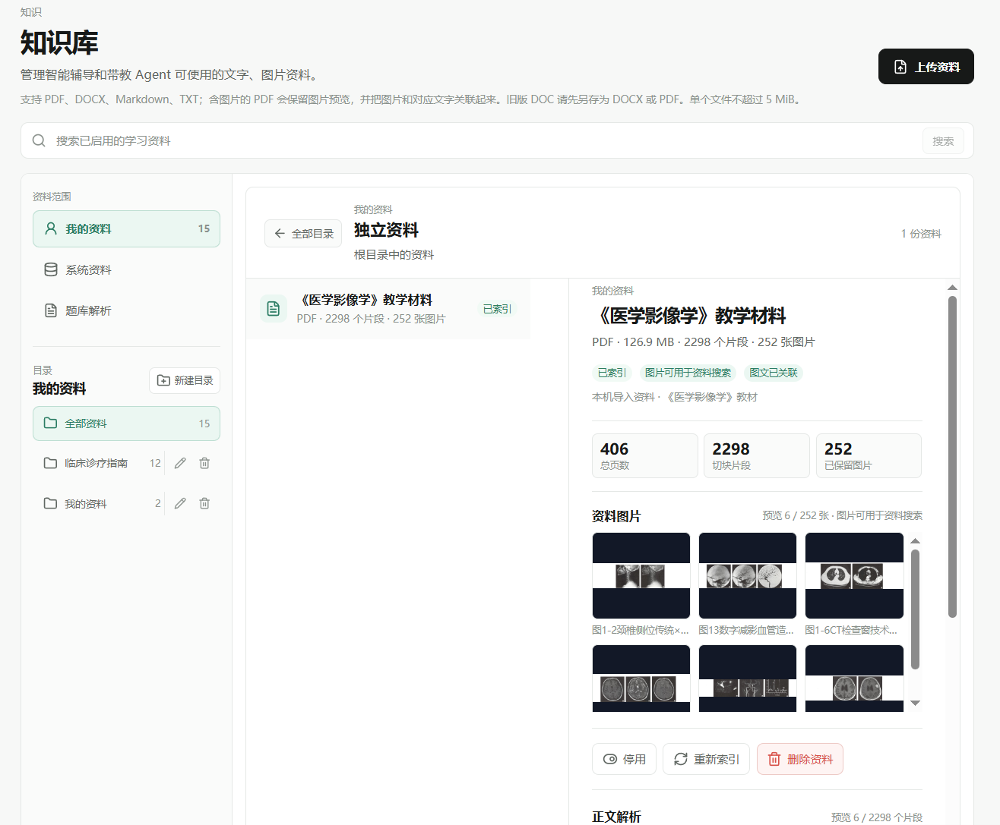

# TiBan v3.5.2

> 多模态知识库与图文证据链版本记录

- 版本：`v3.5.2`
- 日期：2026-09-13
- 主线：`refactor/v3-tiban-agent-experience`
- 定位：把学习资料、图像证据与 Tutor / Mentor 的检索上下文连接成可回溯的多模态学习链路。

## 本版本交付

- 统一 PDF、DOCX、Markdown 和 TXT 的结构化解析中间层，先识别页面、标题、正文、表格、图注和图片，再进行层级化、Token-aware 切块。
- PDF 采用文本块与图片位置的版面感知解析；真实 Figure 经过尺寸、覆盖率、重复哈希和 Figure caption 对齐后才进入图片检索，整页截图、Logo、页眉和无可靠图注的图片只保留为预览或被过滤。
- 文本检索使用 BGE-M3 的可配置稠密/混合召回，图片检索使用 CLIP 文本到图片召回，Qdrant 保存版本化向量和 provenance payload。
- 受控 Evidence Graph 只建立“文本提及/解释概念”“Figure 展示概念”“Caption 对应 Figure”和同页图文关系，支持文字 → 图片、图片 → 文字的一跳证据扩展。
- Tutor / Mentor 的图文证据包保留资料名、页码、章节、图注和图片来源；视觉 Provider 支持时传入真实图片内容块，文本模式不伪装成看过图片。
- 题库图片资产与知识库图片索引保持隔离；资料生成题目仅在图片具备可靠图注和来源关系时使用图片题草稿。
- 知识库页面支持“我的资料”默认范围、目录/根目录资料、管理与批量索引、资料删除（保留本地原文件）、详情滚动和解析摘要。
- 运行时可选 OCR 用于无文字 PDF 页面；OCR 未启用或无法完成时明确保留“需要识别”的状态，不把页面截图冒充教学 Figure。

## 当前多模态资料证据



上图来自当前本机知识库页面：`《医学影像学》教学材料` 共 406 页，详情页显示 2,298 个切块片段和 252 张已保留图片，并同时展示资料图片预览、正文解析和图文已关联状态。该截图是产品界面证据，不是把教材原始文件提交到仓库；原始教材和运行时媒体资产仍留在本机授权环境。

## 可用于项目介绍的技术关键词

`Multimodal RAG` · `Layout-aware Ingestion` · `Structured Document Parsing` · `Figure-caption Grounding` · `BGE-M3` · `CLIP` · `Qdrant` · `Evidence Graph / GraphRAG` · `Cross-modal Retrieval` · `Provenance` · `Vision Agent` · `OpenAI-compatible Vision API` · `Versioned Indexing` · `Candidate-pool Reranking`

建议将本版本表述为：

> 基于版面感知解析构建结构化图文中间层，把正文、Figure、Figure caption、章节和页码统一绑定；使用 BGE-M3 + CLIP + Qdrant 完成文本/图片多路召回，再通过受控 Evidence Graph 做一跳跨模态证据扩展，将可追溯的图片、图注、页码和文字上下文交给 Tutor / Mentor Vision Agent。

## 质量与工程验证

本版本的质量口径是可复现的工程指标，不将其包装成临床验证：

- 文档侧：页面分类、正文切块、Figure/caption 对齐、图片过滤和解析覆盖率。
- 检索侧：Image Recall@3、图注正确率、页码正确率、文字 → 图片关联率、图片 → 文字关联率和图谱噪声过滤率。
- 性能侧：文本检索和完整图文证据包的 P50/P95、候选集重排成本与热查询吞吐。
- 产品侧：知识库详情来源链路、Tutor/Mentor 图片证据输入、纯文本资料回归和题库图片隔离。

真实运行数字以本机评测脚本和本次发布验收输出为准，不在版本文档中预填未经运行的提升比例。

本次发布验收（2026-09-13）结果：

- `python -m compileall app`：通过。
- `python -m pytest -q`：`178 passed, 1 skipped`；存在现有 Python/FastAPI 弃用告警，不影响测试结果。
- `npm run api:check`：通过，OpenAPI 生成类型与当前接口一致。
- `npm run lint`：通过。
- `npm test -- --run`：`6` 个测试文件、`56 passed`。
- `npm run build`：通过，Vite 生产构建完成。
- `docker compose config -q`：通过。
- `git diff --check`：通过。

复现命令：

```powershell
cd backend
$env:PYTHONPATH='.'
python -m compileall app
python -m pytest -q
python scripts/benchmark_multimodal_rag.py --strict

cd ../frontend
npm run api:check
npm run lint
npm test -- --run
npm run build
```

## 数据与安全边界

- 当前展示使用本机已获许可的教学资料；原始医学教材、运行时上传文件、向量库数据和 API 凭证不进入 Git。
- 题库图片不进入知识库图片向量索引，EndoBench 仍保持评测隔离。
- 医学内容仅用于教学研修和医生复核前辅助，系统输出不替代临床诊断、治疗决策或最终报告。
