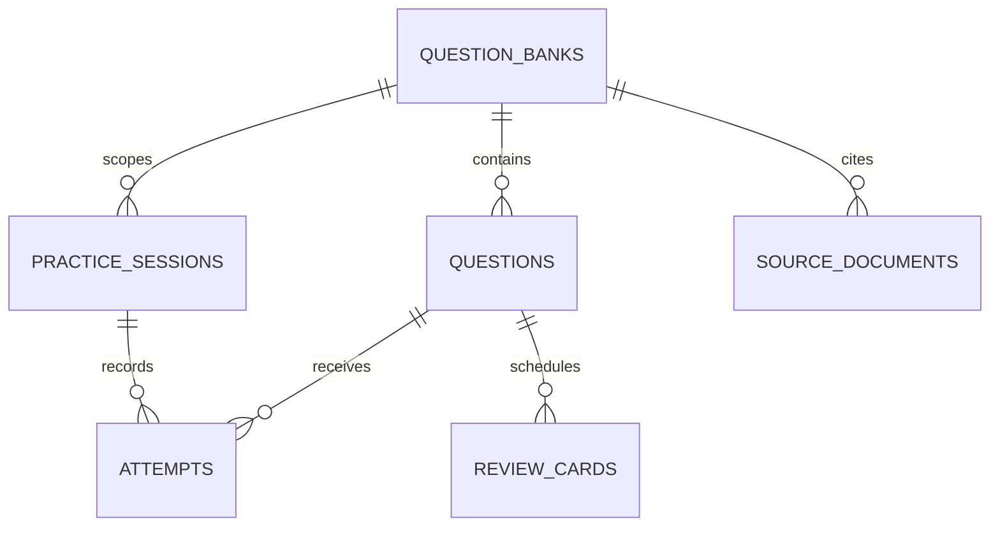

# EndoTutor Stage 1 — Core Platform Reconstruction Report

Date: 2026-08-28
Branch: `refactor/v3-agent-learning-platform`
Stage 1 starting point: `9befbe104d2ed165c535e9069b01037ac4a94de6`
Rollback point: `1976d58` (last implementation commit; `7026df5` is the backend-only rollback point)

## Executive result

The Stage 1 core platform was reconstructed across the approved three internal workstreams:

1. Contract First: public/private four-way discriminated question contracts and answer isolation.
2. Persistence: SQLAlchemy 2 + Alembic schema, idempotent real-catalog seed, attempts and review cards.
3. Frontend Product Rebuild: a four-page React 19/Vite product flow using one canonical `/api/v3` client.

All Stage 1 Gates passed, including a clean PostgreSQL 16 runtime verification in Docker Desktop. The runtime proof covers Alembic migration, idempotent seed, typed submit, deterministic review-card scheduling, service restart, and direct relational verification. Stage 1 stops here and does not enter Stage 2.

## Commit list

| Commit | Scope |
|---|---|
| `9befbe1` | approved Phase 0 baseline HEAD / Stage 1 start |
| `7026df5` | Stage 1 Pydantic contracts, FastAPI routes, SQLAlchemy models/repository, Alembic, seed and backend contract tests |
| `1976d58` | React four-page rebuild, canonical typed API, responsive UI, Vitest/RTL and Playwright tests |
| `88ae46a` | Stage 1 report, architecture/evaluation docs, screenshots and visual-review evidence |
| `2c3ff29` | final report formatting cleanup |
| `b9fd6a2` | complete Stage 1 commit history in the report |

Existing user-owned changes in `artifacts/eval/latest.json`, `artifacts/eval/latest.md`, and portfolio audit files were not staged or modified by the Stage 1 commits.

## Baseline and migration decision

The approved Baseline Decision and overall technical route remain unchanged. The current HEAD was used as the base, and all Stage 1 work was performed on `refactor/v3-agent-learning-platform`. Phase 0 baseline history was preserved in the existing baseline/ADR documents.

## Contract changes

`backend/app/schemas/stage1.py` introduces:

| Boundary | Shape |
|---|---|
| `QuestionPublic` | discriminated union of public single/multiple/true-false/short-answer variants |
| `QuestionForGrading` | same discriminator with server-only answer/rubric contracts |
| `QuestionAdmin` | explicit private/admin alias |
| `QuestionDraft` | explicit private/draft alias |

Public variants expose stable option IDs and never expose `answer`, `correct_option_id(s)`, `expected_facts`, rubric, or reference answers. The server materializes grading data only after submit and returns public feedback.

Canonical endpoints:

```text
GET  /api/v3/question-banks
GET  /api/v3/question-banks/{bank_id}
GET  /api/v3/overview
GET  /api/v3/practice/questions
GET  /api/v3/practice/questions/{question_id}
POST /api/v3/practice/sessions
POST /api/v3/practice/submit
POST /api/v3/tutor/hint
GET  /api/v3/evaluation/latest
```

The old `/api` practice routes remain compatibility-only. The new frontend does not import `src/lib/api.ts`, `src/lib/v3Api.ts`, or `src/lib/adapters.v2.2.2.ts`.

## Database changes

Alembic revision `0001_stage1_core` creates only the approved first six entities:

```text
question_banks
questions
practice_sessions
attempts
review_cards
source_documents
```



The runtime path is `SQLAlchemy Session → Stage1Repository → Stage1Service`. `Attempt` rows are append-only per submit; `ReviewCard` is unique per learner/question and is updated as the deterministic review projection. JSON remains seed/fixture/import/export/evaluation input, not runtime submit state.

Fresh migration verification performed:

```text
$env:ENDO_DATABASE_URL = "sqlite:///./runtime/data/stage1-fresh-20260828.sqlite3"
alembic upgrade head                         PASS
initialize_database()                         58 records seeded
tables                                        6 domain tables + alembic_version
```

PostgreSQL runtime verification: PASS. Docker Desktop ran `postgres:16-alpine` locally through [`compose.stage1-postgres.yml`](../../compose.stage1-postgres.yml), bound only to `127.0.0.1:55432`. Starting from its new named volume, Alembic created the schema, the first seed created 58 questions, and a repeat seed created 0. A real `/api/v3/practice/submit` request then created one immutable `Attempt` and one `ReviewCard`; both rows remained after the FastAPI service was restarted. See [PostgreSQL persistence evidence](../evals/stage-1-postgres-persistence.md).

## Frontend component tree

```text
frontend/src/
├── App.tsx
├── app/
│   ├── AppShell.tsx
│   ├── providers.tsx
│   └── router.tsx
├── api/
│   ├── client.ts
│   └── generated.ts
├── components/shared/AsyncState.tsx
├── pages/
│   ├── overview/OverviewPage.tsx
│   ├── banks/BanksPage.tsx
│   ├── practice/PracticePage.tsx
│   └── evaluation/EvaluationPage.tsx
└── test/core-pages.test.tsx
```

Implemented product behavior:

- Overview reads real overview/bank/recent-attempt data and has empty/loading/error states.
- Banks reads real bank counts, modality/type breakdown, progress, search and type filter; no fake generate/save CTA.
- Practice supports all four public variants, stable option IDs, image, submit feedback, next, and the deterministic rule-hint Tutor boundary.
- Mobile Tutor is an accessible bottom sheet/drawer, labeled `规则提示 · Stage 2 Agent 未启用`.
- Evaluation only reads the existing artifact and shows `尚未运行` when unavailable; the present artifact is labeled offline and not clinical/model performance.

## Validation matrix

| Gate | Result | Evidence |
|---|---|---|
| Backend tests | PASS — 23 passed | `backend/tests/test_stage1_contracts.py` + existing tests |
| Answer isolation | PASS | recursive public/detail/submit contract assertions |
| Four question types | PASS | typed submit contract test and RTL controls |
| Bank filtering/switching | PASS | backend disjoint-ID test + Banks RTL test + Playwright route |
| OpenAPI union | PASS | OpenAPI variant schema assertions |
| Frontend unit tests | PASS — 6 passed | `frontend/src/test/core-pages.test.tsx` |
| Frontend lint | PASS — 0 errors/warnings in active Stage 1 source | `npm run lint` |
| Frontend build | PASS | `npm run build` |
| Playwright core flow | PASS — 1 core test | `frontend/e2e/core-flow.spec.ts` |
| Responsive screenshot flow | PASS — 16 page captures + mobile Tutor capture | `frontend/e2e/capture-stage1.spec.ts` |
| No production mock in main flow | PASS | canonical client uses real fetch; mocks exist only in unit tests |
| PostgreSQL persistence | PASS — Docker PostgreSQL 16 migration, seed, idempotency, submit/review card and restart persistence | [runtime evidence](../evals/stage-1-postgres-persistence.md) |

Commands used:

```text
backend:  pytest -q                                  23 passed
frontend: npm run test                              6 passed
frontend: npm run lint                              PASS
frontend: npm run build                             PASS
frontend: npm run test:e2e                          2 passed
```

## Evidence

- [Stage 1 system architecture](../architecture/stage-1-system-architecture.md)
- [Stage 1 contract tests](../evals/stage-1-contract-tests.md)
- [Stage 1 E2E results](../evals/stage-1-e2e-results.md)
- [Stage 1 PostgreSQL persistence](../evals/stage-1-postgres-persistence.md)
- [Screenshot/evidence index](../portfolio/evidence/stage-1/README.md)
- [Visual review loop](../portfolio/evidence/stage-1/visual-review.md)

## Known limitations and unfinished capability

- The local fallback remains SQLite for no-Docker development; PostgreSQL 16 Docker runtime acceptance is now complete.
- Tutor is a rule-hint boundary only. AgentRunner, ToolRegistry, ModelGateway, AgentContext, AgentEvent, AgentResult, retry/timeout/cancel/permissions/trace, and Langfuse evaluation visualization remain Stage 2 work.
- Qdrant retrieval and sparse/dense/hybrid/hybrid+rerank Recall@K/MRR/nDCG artifacts remain Phase 5 work.
- Mastery is currently represented by deterministic attempt/review projections; no broad learner model or adaptive agent loop was introduced.
- Legacy pages and clients remain for compatibility and are isolated from the new main route. They should be retired only after a later migration decision.

## Stop condition

Stage 1 work stops at this report. No Stage 2 implementation, Agent Harness work, RAG work, or Question Factory work was started automatically.
